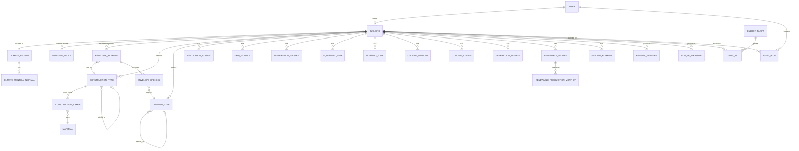

# YRES Entity-Relationship Design

Derived from `docs/data-dictionary.md`. This document translates the workbook's 27
conceptual entities into a concrete PostgreSQL schema (see `packages/db/src/schemas/`).

## Design principles

1. **Inputs are persisted; calculations are not.** Per the brief, we never store a
   computed value (heat loss, energy need, NPV, U-value...) — those are recomputed on
   demand by the calculation services (Phase 2) from the persisted inputs below. The
   only "calculated" data that *is* stored is workflow metadata for an audit run
   (status/timestamps/report location), not the numbers themselves.
2. **`scenario` replaces "before/after" column pairs.** Nearly every input sheet in the
   Excel workbook has a mirrored "before renovation" / "after renovation" block with
   the same shape. Rather than duplicate every column, tables that vary by scenario
   carry a `scenario` enum (`before` | `after`) and a row per scenario. A construction
   type's "after" row links back to its "before" row via `retrofit_of_id` so the app
   can find "what does this get replaced with."
3. **Geometry is scenario-independent; construction assignment is not.** An
   `envelope_elements` row (a wall/socle segment) has one geometry regardless of
   scenario — only *which construction type* clads it changes after retrofit. The
   after-renovation construction is found by following `retrofit_of_id` from the
   element's assigned (before) construction type.
4. **Reference/lookup data is global, not per-building**, unless the workbook shows it
   being edited per project (materials, pipe-loss tables, lamp power-density table,
   surface resistance table, climate normals — global; envelope geometry, construction
   layers, equipment inventory — per building).

## Entity-relationship diagram

## Table catalogue

### Reference / global data (seeded, admin-managed)
- `material` — construction material name → thermal conductivity [W/mK].
- `surface_resistance` — element category → interior/exterior surface resistance [m²K/W].
- `pipe_loss_reference` — diameter class × mean fluid temp → max heat-flux density [W/m].
- `lamp_type` — lighting technology → power density [W/m²].
- `energy_tariff` — energy carrier → unit cost, emission factor, primary energy factor,
  exchange rate, effective date (versioned over time; a building's audit run uses the
  tariff row effective as of the run date).
- `climate_region` / `climate_monthly_normal` — regional climate normals (Uzbekistan
  regions), monthly avg temp + solar radiation by orientation.

### Per-building inputs
- `building` — core parameters (`Building_data` sheet): heating season, design temps,
  occupant count, indoor temps, cooling enthalpies. Floor area/volume are **not**
  stored as overrides — they're derived from `building_block` rows, matching the
  Excel's `Envelope!L95`/`M95` → `Building_data!D4`/`D5` relationship.
- `building_block` — footprint blocks (`Envelope` rows 87-95): dimensions, floor count,
  perimeter-loss coefficient → net heated floor area/volume per block.
- `construction_type` — named wall/roof/floor/socle assembly, scenario-tagged, with
  `retrofit_of_id` linking a before-type to its after-type.
- `construction_layer` — ordered material layers for a construction type.
- `opening_type` — named window/door product with a directly specified U-value
  (matches the workbook — window/door U-values are entered as constants, not derived
  from layers), scenario-tagged with `retrofit_of_id`.
- `envelope_element` — one row per facade/wall/socle segment: geometry + assigned
  (before-renovation) construction type.
- `envelope_opening` — windows/doors punched into an envelope element, by opening type
  and count.
- `ventilation_system` — natural or mechanical ventilation parameters, scenario-tagged
  (ACH, fresh-air rate, heat-recovery efficiency).
- `dhw_source` — domestic hot water generation source: specific consumption, persons
  served, energy carrier, scenario-tagged.
- `distribution_system` — heating or DHW pipe segment: diameter class, length,
  insulated fraction, mean fluid temp, scenario-tagged.
- `equipment_item` — electrical appliance/device inventory row, scenario-tagged.
- `lighting_zone` — lit area with lamp-technology mix and utilization factor,
  scenario-tagged.
- `cooling_window` — glazing solar-gain input for cooling-load calc (orientation,
  g-value, shading factor), scenario-tagged.
- `cooling_system` — cooling generation (SEER), scenario-tagged.
- `generation_source` — energy generator serving heating/DHW/cooling end-use
  (efficiency, share of demand), scenario-tagged.
- `renewable_system` — PV or solar-DHW system sizing (capacity, area, unit cost).
- `renewable_production_monthly` — forecast monthly production for a renewable system.
- `shading_element` — external shading device spec and cooling-season gain reduction.
- `energy_measure` — a candidate EE measure: investment cost, lifetime, maintenance %,
  proposed-for-implementation flag. Savings/NPV/IRR/payback are computed on demand by
  `FinancialService`, not stored.
- `non_ee_measure` — ancillary (non-energy-saving) renovation cost item.
- `utility_bill` — historical metered consumption + expense, by carrier/year/month.

### Workflow metadata (the one "calculated" thing we do persist)
- `audit_run` — a single execution of the audit engine for a building: status,
  timestamps, generated report location. The audit's numeric *results* are recomputed
  from the inputs above each time they're requested, but the run's lifecycle (so the UI
  can show progress/history and let the user re-download a past report) is tracked here.

### Auth (Better Auth)
- `user`, `session`, `account`, `verification` — standard Better Auth tables.

## Computed-only result shapes (not database tables)

These live as TypeScript types in `packages/types/`, produced by the Phase-2
calculation services from the inputs above:

- `UValueResult` — U-value for a construction/opening type.
- `MonthlyClimateRecord` — per-month working climate data for a building's heating
  season (derived from `climate_monthly_normal` + the building's heating season config).
- `EnvelopeHeatLoss`, `VentilationLoss`, `HeatGainRecord` — monthly/annual loss and gain
  figures per category, before/after.
- `HeatingEnergyBalance` — the EN ISO 13790 monthly balance output (gains, losses,
  utilization factor, net energy need).
- `FinalEnergyConsumption` — per generation source, after distribution + generation
  losses are applied.
- `EnergyBalanceSummary` — theoretical-vs-actual reconciliation
  (`Breakdown Baseline & Balance`).
- `EnergyMeasureResult` — a measure's computed savings, simple/discounted payback, NPV,
  IRR, CO2 reduction (`packages/types/src/measures.ts`).
- `CashflowYear` / `FinancialIndicators` — per-measure 20-year cash flow and investment
  appraisal (`packages/types/src/financial.ts`).

## Known source-data issues carried into the design

The data dictionary's "Ambiguities" section flags several bugs in the original
workbook (non-standard `(2-efficiency)` formula instead of `/efficiency`, a
maintenance-cost formula pinned to the wrong block's investment cell, an anomalous 8%
savings-escalation rate, broken `#REF!`/dangling-reference cells, 5 orphaned Financial
indicators blocks). The schema itself is neutral to these — they're calculation-service
concerns (Phase 2), not data-model concerns — but whoever implements `FinancialService`
and `GenerationSource` energy-consumption logic needs to decide, with the domain expert,
whether to replicate each bug for parity with existing reports or correct it.
