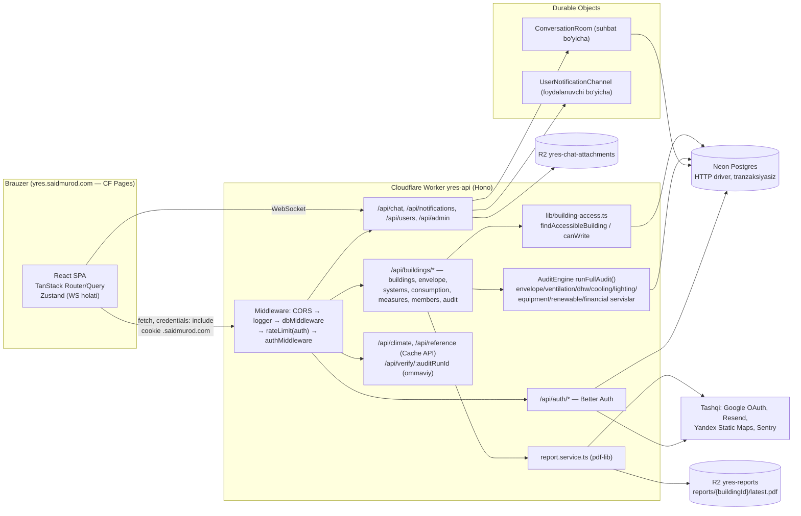
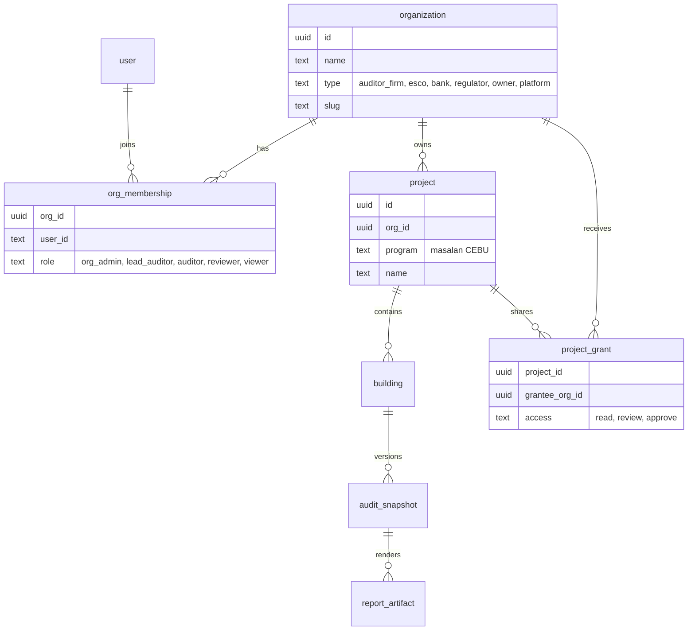
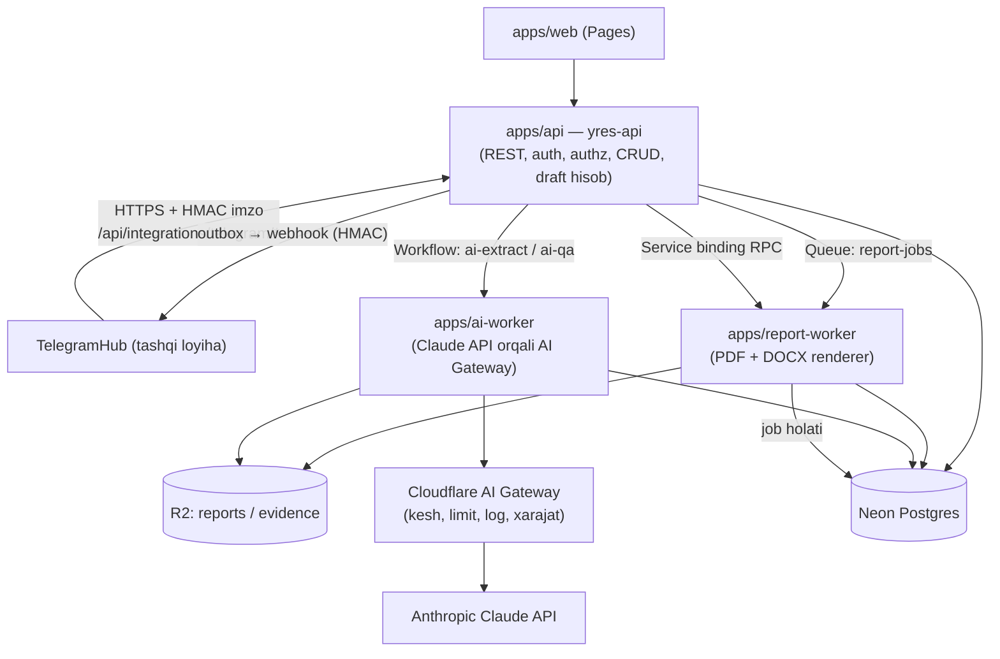

# 02 — Arxitektura va texnologiyalar: production-tayyorlik auditi

> Holat sanasi: 2026-09-27 · Repo holati: `0cf56dd` (135 commit) · Muallif: arxitektura audit agenti (faqat o'qish rejimida tayyorlangan — kodga tegilmagan).
> Bu hujjat `README.md`, `PROGRESS.md`, `.claude/rules/*.md` va manba kodni o'qish asosida yozilgan. Fayl:qator havolalari shu commit holatiga tegishli.

## Mundarija
1. Joriy arxitektura xaritasi
2. Production-tayyorlik auditi (topilmalar)
3. Texnik qarz ro'yxati
4. Kelajak modullari arxitekturasi (TelegramHub, AI, hisobot generatsiyasi, bino-turi shablonlari)
5. Yangi dasturlash qoidalari (`.claude/rules/` uchun taklif)
6. ADR ro'yxati
7. Tavsiya etilgan texnik fazalar

---

## 1. Joriy arxitektura xaritasi

### 1.1 Qatlamlar

| Qatlam | Texnologiya | Joylashuv | Izoh |
|---|---|---|---|
| Frontend | React 19, Vite 6, TanStack Router/Query, Tailwind v4, Zustand, react-i18next, recharts, `xlsx` | `apps/web` → Cloudflare Pages `yres-web` (`yres.saidmurod.com`) | SPA, fayl-asoslangan route'lar, `_authenticated.tsx` sessiya darvozasi |
| UI kutubxona | shadcn/Radix uslubi | `packages/ui` | `@source` nozik jihati (`frontend.md`) |
| API | Hono 4 on Cloudflare Workers (`nodejs_compat`) | `apps/api` → Worker `yres-api-production` (`yres-api.saidmurod.com`) | Monolit Worker: REST + auth + PDF + DO |
| Auth | Better Auth 1.x (email/parol + Google OAuth), cross-subdomain cookie `.saidmurod.com` | `apps/api/src/auth/index.ts` | Sessiya 7 kun, DB-backed |
| Hisob dvigateli | Sof TS servislar (EN ISO 13790, `3-DMTT v5.xlsx` replikasi) | `apps/api/src/services/*.service.ts`, `audit.engine.ts` | Natija saqlanmaydi, har so'rovda qayta hisoblanadi |
| Hisobot | `pdf-lib` + fontkit, PT Serif (≈800 KB TS-embed), QR, Yandex Static Maps | `services/report.service.ts` (1 436 qator) | Sinxron, so'rov ichida generatsiya |
| Real-time | Durable Objects (`ConversationRoom`, `UserNotificationChannel`), Hibernation API | `apps/api/src/durable-objects/` | Postgres — haqiqat manbai |
| Ma'lumotlar bazasi | Neon Postgres, `drizzle-orm/neon-http` (tranzaksiyasiz), 10 migratsiya | `packages/db` | `db.batch()` atomiklik uchun |
| Fayl saqlash | R2: `REPORTS_BUCKET`, `CHAT_ATTACHMENTS_BUCKET` | `wrangler.toml` | Audit dalillari (foto, teplovizor, hujjat) uchun saqlash YO'Q |
| Kesh | Workers Cache API (`lib/http-cache.ts`) | Faqat ma'lumotnoma endpoint'lari | |
| Rate limit | CF Rate Limiting binding (`unsafe.bindings`) + in-memory fallback | `middleware/rate-limit.ts` | Faqat auth endpoint'lari |
| Kuzatuv | Sentry (`@sentry/cloudflare`, faqat API), `hono/logger` | `apps/api/src/index.ts:113` | Web'da Sentry yo'q, metrika yo'q |
| Email | Resend | `lib/email.ts` | Xush kelibsiz + parol tiklash |
| CI/CD | GitHub Actions `ci.yml` (lint/type/test/e2e/build), `deploy.yml` (hech qachon ishlatilmagan) | `.github/workflows` | Amalda qo'lda deploy |

### 1.2 Modullar va ma'lumotlar oqimi



**Asosiy oqim (audit → hisobot):**
1. Auditor bino kiritmalarini (`building`, `envelope`, `systems`, `consumption`, `measures`) PUT/POST qiladi — "qatorlarni almashtirish" andozasi (`delete + insert` → `db.batch()`).
2. `POST /:id/audit/run` — `audit_run` qatori (`running`) yaratiladi, `runFullAudit()` sinxron bajariladi, natija **faqat javobda qaytadi**, `audit_run` → `completed`.
3. `GET /:id/audit/results` va `GET /:id/audit/report` natijani **joriy** kiritmalar va **eng so'nggi global tarif** bo'yicha qayta hisoblaydi; PDF `reports/{buildingId}/latest.pdf` ga ustidan yoziladi; QR `/verify/{auditRunId}` ga ishora qiladi.

**Muhim arxitektura xususiyati:** `audit_run` — faqat hayot sikli yozuvi; hisoblangan natija ham, kiritma snapshot'i ham saqlanmaydi. Bu bank-tayyor hisobot uchun eng katta arxitektura bo'shlig'i (2.5-bo'limga qarang).

### 1.3 Ruxsatlar modeli (joriy)

| Daraja | Qiymatlar | Qayerda tekshiriladi |
|---|---|---|
| Global rol `user.role` | `admin`, `auditor`, `viewer` | Faqat `/api/admin/*` (`requireRole("admin")`). `viewer` hech qayerda cheklanmaydi |
| Bino roli | `owner` (= `building.userId`), `editor`, `viewer` (`building_member`) | Har route'da qo'lda `findAccessibleBuilding` + `canWrite` |
| Tashkilot | YO'Q | — |

---

## 2. Production-tayyorlik auditi

Jiddiylik: **Kritik** — hozir ma'lumot sizishi/akkaunt egallash yoki bank oldida yaroqsiz hisobotga olib keladi; **Yuqori** — production'dan oldin tuzatilishi shart; **O'rta** — birinchi 1–2 oy ichida; **Past** — texnik gigiyena.

### 2.1 Xavfsizlik — autentifikatsiya va sessiya

| # | Jiddiylik | Topilma | Fayl:qator | Tavsiya |
|---|---|---|---|---|
| S-1 | **Kritik** | **Pre-account-takeover (akkauntni oldindan egallash).** Email/parol ro'yxatdan o'tish email tasdiqlashni talab qilmaydi (`requireEmailVerification` yo'q) VA `accountLinking.requireLocalEmailVerified: false`. Hujumchi `victim@gmail.com` bilan parol akkaunt yaratadi; keyinchalik haqiqiy egasi "Google bilan kirish"ni bossa, Google identifikatsiyasi hujumchi yaratgan akkauntga ulanadi — hujumchining paroli ishlashda davom etadi va u jabrlanuvchining barcha binolarini ko'radi. | `apps/api/src/auth/index.ts:258-259`, `:304-314` | `auth.md` qarorini buzmasdan tuzatish: (a) `emailAndPassword.requireEmailVerification: true` + "tasdiqlashni qayta yuborish" oqimi (auth.md aynan shu shartni qo'ygan); yoki (b) Google link paytida lokal akkaunt tasdiqlanmagan bo'lsa, `account` jadvalidagi `credential` parolini bekor qilish (password hash'ni o'chirish) va barcha eski sessiyalarni revoke qilish. (b) — auth.md'dagi UX'ni saqlaydi. |
| S-2 | **Yuqori** | Sessiya cookie domeni `.saidmurod.com` — shaxsiy domenning **barcha** subdomenlariga (boshqa loyihalar, bot landing'lar, eksperimentlar) sessiya cookie yuboriladi; har qanday subdomendagi XSS/buzilgan servis YRES sessiyasini o'g'irlashi mumkin. | `apps/api/src/auth/index.ts:325-331` | Production uchun alohida registrable domen (masalan `yres.uz`: `app.yres.uz` + `api.yres.uz`) yoki API'ni Pages bilan bir origin'ga olib o'tish (`yres.saidmurod.com/api/*` → Worker route) — shunda cross-subdomain cookie umuman kerak bo'lmaydi. ADR-003. |
| S-3 | O'rta | Rate-limit binding `simple = { limit = 10, period = 60 }` barcha kalitlarga bir xil — koddagi `max: 5` (parol tiklash) production'da e'tiborsiz qoladi; `x-forwarded-for` fallback soxtalashtiriladi; sign-in faqat IP bo'yicha (email bo'yicha emas) cheklanadi. | `apps/api/wrangler.toml:103-107`, `src/middleware/rate-limit.ts:31-38`, `src/index.ts:78-83` | Har bir limit uchun alohida binding (`RATE_LIMITER_AUTH`, `RATE_LIMITER_RESET`, `RATE_LIMITER_API`); faqat `cf-connecting-ip`; email+IP kompozit kalit; umumiy yozish API'lariga ham (user-id bo'yicha) limit. |
| S-4 | O'rta | Xush kelibsiz email HTML'iga `user.name` escape'siz qo'yiladi — email HTML injection (phishing link). | `apps/api/src/auth/index.ts:252` | `escapeHtml()` yordamchisi; email shablonlarini alohida modulga. |
| S-5 | Past | Parol siyosati Better Auth standarti (min 8); HIBP tekshiruvi, 2FA yo'q. Bank/regulyator foydalanuvchilari uchun 2FA kerak bo'ladi. | `auth/index.ts:258` | Better Auth `twoFactor` plagini — `bank`/`regulator`/`admin` rollari uchun majburiy. |

### 2.2 Xavfsizlik — avtorizatsiya (authz), IDOR

| # | Jiddiylik | Topilma | Fayl:qator | Tavsiya |
|---|---|---|---|---|
| A-1 | **Yuqori** | Authz har route'da qo'lda takrorlanadi (≈40 joyda `findAccessibleBuilding` + `canWrite`). Hozir IDOR topilmadi — bola resurslar `and(eq(id), eq(buildingId))` bilan cheklangan (masalan `measures.ts:97-99`, `members.ts:137-139`) — lekin bitta unutilgan tekshiruv to'liq IDOR bo'ladi va hech qanday test/lint buni ushlamaydi. | `apps/api/src/routes/*.ts` | `buildingScope(minRole)` middleware: `/:id/*` uchun bir marta yuklab `c.set("buildingAccess")`; route'lar uni o'qiydi. Har yangi route uchun "viewer yozolmaydi / begona 404" integratsiya test matritsasi (ADR-002). |
| A-2 | O'rta | `viewer` bino a'zosi `POST /:id/audit/run` (DB'ga `audit_run` yozadi) va `GET /:id/audit/report` (R2'ga yozadi + `audit_run.reportR2Key` ni yangilaydi) ni chaqira oladi — GET so'rovda yon ta'sir. | `apps/api/src/routes/audit.ts:30-38`, `:181-185` | `run` → `canWrite` talab qilsin; hisobot generatsiyasi alohida `POST /:id/reports` (yozuv) va `GET /reports/:reportId` (o'qish) ga ajratilsin. |
| A-3 | O'rta | Global `user.role = viewer` hech qayerda kuchga kirmaydi — "faqat-o'qish" global foydalanuvchi bino yarata oladi, chat boshlay oladi. | `apps/api/src/middleware/require-role.ts`, `routes/buildings.ts:158` | Yangi rol modeli bilan (2.4) almashtirilsin; oraliqda `POST /buildings` ga `requireRole("admin","auditor")`. |
| A-4 | O'rta | Chat foydalanuvchi qidiruvi `ilike(username, %q%)` — `username` sukut bo'yicha **email** (`social-features.md`), shuning uchun istalgan ro'yxatdan o'tgan foydalanuvchi `q=@gm` kabi so'rovlar bilan boshqa foydalanuvchilarning email'larini sanab chiqa oladi; `%`/`_` escape qilinmagan. | `apps/api/src/routes/chat.ts:417-433` | Qidiruvni bir tashkilot a'zolari bilan cheklash; javobda email-username'ni maskalash; LIKE wildcard escape; username default'ini email emas, tasodifiy slug'ga o'zgartirish (ADR taklifi). |
| A-5 | Past | `POST /:id/members` — mavjud/mavjud emas email uchun turli xabar (email enumeration, faqat bino egalari uchun). | `apps/api/src/routes/members.ts:66-71` | Tashkilot-invite modeliga o'tganda "taklif yuborildi" yagona javobi. |
| A-6 | Past | `/api/verify/:auditRunId` ommaviy, lekin rate-limitsiz; bino nomini oshkor qiladi (UUID capability URL — qabul qilinadi). | `apps/api/src/routes/verify.ts:21-45` | Rate-limit + verify'da hisobot xeshini (2.5) ko'rsatish. |

### 2.3 Xavfsizlik — input validatsiya, fayllar, brauzer

| # | Jiddiylik | Topilma | Fayl:qator | Tavsiya |
|---|---|---|---|---|
| V-1 | **Yuqori** | **Chat biriktirmalari orqali stored XSS.** Fayl mijoz bergan `Content-Type` bilan saqlanadi va API origin'ida (`yres-api.saidmurod.com`) `Content-Disposition`siz, `X-Content-Type-Options`siz qaytariladi. `text/html`/`image/svg+xml` yuklangan fayl chat a'zosi ochganda API origin'ida skript bajaradi va cookie bilan istalgan API chaqiruvini qila oladi. | `apps/api/src/routes/chat.ts:466-469`, `:518-521` | MIME allowlist (rasm/pdf/docx/xlsx), SVG/HTML taqiqi; javobda `Content-Disposition: attachment` (rasm'dan tashqari), `X-Content-Type-Options: nosniff`, `Content-Security-Policy: sandbox`; kelajakda alohida "user content" domeni. |
| V-2 | O'rta | WebSocket freymlari validatsiyasiz: `attachmentUrl` ixtiyoriy satr; frontend `${API_URL}${m.attachmentUrl}` qiladi — `attachmentUrl="@evil.com/x"` → `https://yres-api.saidmurod.com@evil.com/x` (userinfo trick) tashqi saytga olib ketadi. `body` uzunligi cheksiz. `edit`/`delete` — `conversationId` tekshirmaydi; a'zolikdan chiqarilgan foydalanuvchi socket'i ulangan qoladi. | `apps/api/src/durable-objects/conversation-room.ts:60-126`; `apps/web/src/routes/_authenticated/chat/$conversationId.tsx:143-152` | DO ichida zod sxema (`schemas/chat.ts`), `attachmentUrl` faqat `^/api/chat/attachments/chat/{conversationId}/` prefiksi; body ≤ 4 000 belgi; edit/delete'da `conversationId` sharti; a'zo o'chirilganda DO RPC orqali socket'ni yopish. |
| V-3 | O'rta | Massivlar chegarasiz (`bills: z.array(...).min(1)` max yo'q; envelope/systems PUT massivlari), `year` chegarasiz, fizik kattaliklar (`indoorTempOperationC` va h.k.) diapazonsiz — bitta so'rov bilan juda katta `db.batch()` va dvigatelda NaN/Infinity natijalar. | `apps/api/src/schemas/consumption.ts:9-21`, `schemas/building.ts:10-31`, `schemas/systems.ts:43` | Har massivga `.max()`; fizik diapazonlar (masalan harorat −60…+60, yil 1900…2100); body hajmi limiti (`hono/body-limit`, 1 MB JSON). |
| V-4 | O'rta | Frontend `xlsx@0.18.5` (SheetJS npm'dagi so'nggi versiya) — ma'lum zaifliklar (CVE-2023-30533 prototype pollution, CVE-2024-22363 ReDoS); foydalanuvchi yuklagan Excel'ni parse qiladi. | `apps/web/package.json` (`xlsx`), `components/building-detail/consumption-excel.ts` | SheetJS CDN tarball (`https://cdn.sheetjs.com/xlsx-0.20.x`) yoki `exceljs`; parse'ni Web Worker'da. |
| V-5 | O'rta | Web uchun xavfsizlik sarlavhalari yo'q (`apps/web/public/` da faqat `_redirects`, `_headers` yo'q): CSP, HSTS, `X-Frame-Options`, `Referrer-Policy`. API javoblarida ham yo'q. | `apps/web/public/`, `apps/api/src/index.ts:63-64` | Pages `_headers` + API'da `hono/secure-headers`. |
| V-6 | Past | `POST /:id/audit/run` xatoda `error.message`ni mijozga qaytaradi (ichki tafsilot sizishi). | `apps/api/src/routes/audit.ts:63-71` | Mijozga umumiy kod + `requestId`; tafsilot Sentry'ga. |
| V-7 | Past | `PATCH /api/users/me` `image` — istalgan URL (tracking pixel, `http:`). | `apps/api/src/schemas/users.ts:11` | Faqat `https:` yoki o'z R2 avatar yuklash endpoint'i. |

### 2.4 Multi-tenancy va rollar modeli (taklif)

Joriy holat: bino = bitta foydalanuvchi (`building.userId`, `onDelete: cascade`), ulashish faqat bino darajasida. Real bozor (WB/CEBU dasturi, ESCO, banklar, vazirlik) uchun **tashkilot** birlamchi tenant bo'lishi kerak.

**Taklif etilgan model (ADR-001):**



| Tashkilot turi | Tipik rollar | Ko'radi / qiladi |
|---|---|---|
| `auditor_firm` (energoaudit kompaniyasi, masalan OPTIV) | `org_admin`, `lead_auditor`, `auditor`, `viewer` | O'z loyihalarini to'liq CRUD; `lead_auditor` snapshot'ni "imzolaydi" |
| `esco` | `org_admin`, `engineer`, `viewer` | Grant qilingan loyihalar; chora-tadbirlar/moliya bo'yicha taklif |
| `owner` (bino egasi — MTT, maktab, hokimlik) | `viewer`, `approver` | Faqat o'z binolari, hisobotlar, izohlar |
| `bank` | `analyst`, `approver` | Faqat **imzolangan snapshot** va hisobotlar (jonli kiritmalar emas), read-only + izoh |
| `regulator` (vazirlik, PIU) | `inspector` | Dastur bo'yicha agregat + snapshot'lar, read-only |
| `platform` | `platform_admin` | Hozirgi global `admin` |

Qoidalar: (1) har bir biznes jadvalda `org_id` (yoki `building → project → org` orqali aniqlanadigan zanjir) bo'ladi; (2) authz bitta modulda — `can(user, action, resource)` (policy funksiyalar), route'larda emas; (3) Postgres RLS **hozircha emas** — Neon HTTP driveri har so'rovda `SET app.user_id` qilishni qiyinlashtiradi; ilova darajasidagi `scopedDb(orgId)` yordamchisi yetarli (ADR-002); (4) mavjud `building_member` migratsiyada `project_grant` + shaxsiy "Personal workspace" tashkilotiga o'tkaziladi (har mavjud foydalanuvchiga bitta avtomatik tashkilot).

### 2.5 Ma'lumotlar yaxlitligi, audit versiyalash va snapshot

| # | Jiddiylik | Topilma | Fayl:qator | Tavsiya |
|---|---|---|---|---|
| D-1 | **Kritik** | **Hisobot qaysi ma'lumot holatidan chiqqanini isbotlab bo'lmaydi.** `audit_run` natija/kiritma saqlamaydi; `/results` va `/report` har safar **joriy** kiritmalar bo'yicha qayta hisoblaydi; PDF `reports/{buildingId}/latest.pdf` ga **ustidan yoziladi**; QR esa eski `auditRunId` ni tasdiqlaydi. Natijada bankka yuborilgan PDF bilan verify sahifasi "tasdiqlagan" raqamlar ertaga boshqacha bo'lishi mumkin. | `apps/api/src/routes/audit.ts:24-29`, `:123-125`, `:157-185`; `packages/db/src/schemas/audits.ts:7-25` | `audit_snapshot` jadvali: `inputs_json` (barcha kiritmalar + ishlatilgan tarif/iqlim/moliya parametrlari), `result_json`, `engine_version` (git sha + `ENGINE_VERSION` konstantasi), `inputs_hash` (sha256), `status` (`draft→submitted→approved→superseded`), `approved_by/at`. Hisobot faqat snapshot'dan; R2 kaliti `reports/{buildingId}/{snapshotId}/{lang}.pdf` (immutable); verify sahifasi `sha256(pdf)` ni ko'rsatsin. `calculation-engine.md`dagi "keshlamang" qoidasi *ishchi* (draft) ko'rinish uchun qoladi — snapshot kesh emas, huquqiy artefakt (ADR-004). |
| D-2 | **Yuqori** | Tariflar global va "eng so'nggi `effectiveDate`" olinadi; diskont stavkasi (`0.04`) va muddat (20 y) kodda konstanta. Tarif jadvali yangilanishi **barcha o'tgan** auditlar natijasini retroaktiv o'zgartiradi; loyiha bo'yicha parametrlar (masalan shartnoma kursi 12 140,91, nominal diskont 6,08 %) kiritib bo'lmaydi. | `apps/api/src/services/audit.engine.ts:707`, `services/report-data.service.ts:184`, `services/financial.service.ts:3-4`, `packages/db/src/schemas/financial.ts` | `project_financial_params` (yoki `building_financial_params`) jadvali: tarif, kurs, diskont, inflatsiya, o'sish sur'atlari, gorizont; global jadval faqat default. Snapshot bu qiymatlarni muzlatadi. |
| D-3 | **Yuqori** | Audit trail yo'q — kim qaysi kiritmani qachon o'zgartirgani saqlanmaydi (faqat `building.updatedAt`; ko'p bola jadvallarda `updatedAt` ham yo'q). "Qatorlarni almashtirish" andozasi (`delete+insert`) tarixni butunlay yo'q qiladi. | `apps/api/src/routes/envelope.ts:245-270`, `routes/consumption.ts:130`, `routes/systems.ts` | `audit_event` jadvali (append-only): `org_id, actor_user_id, entity, entity_id, building_id, action, diff_json, request_id, at`. Har yozuv route'i `db.batch([...mutations, insertAuditEvent])` — xuddi shu batch ichida (atomik). |
| D-4 | **Yuqori** | Qattiq o'chirish va kaskad: `DELETE /buildings/:id` barcha audit tarixini o'chiradi; `building.userId` `onDelete: cascade` — foydalanuvchini o'chirish uning barcha binolari va auditlarini o'chiradi. `audit_run.triggeredByUserId` esa `onDelete`siz — boshqa foydalanuvchi binosida run qilgan user'ni o'chirish FK xatosi beradi (nomuvofiq). | `apps/api/src/routes/buildings.ts:220-230`; `packages/db/src/schemas/buildings.ts:10-12`; `schemas/audits.ts:14-16` | Soft-delete (`deleted_at`) bino/loyiha uchun; egalik tashkilotga o'tgach `user` o'chirilishi binolarni o'chirmaydi (`set null`/qayta tayinlash); snapshot'lar hech qachon kaskad o'chmaydi. |
| D-5 | O'rta | Tranzaksiya yo'qligi: `POST /:id/audit/run` 3 ta alohida yozuv (insert running → hisob → update); Worker to'xtasa `running` abadiy qoladi. `members.ts` invite: insert + notification alohida (qabul qilinadi — `realtime.md`). | `apps/api/src/routes/audit.ts:40-73` | `running` holatlar uchun TTL/"stale → failed" (cron yoki o'qishda); snapshot yaratish bitta `db.batch()`. |
| D-6 | O'rta | Optimistic concurrency yo'q: ikki auditor bir binoning envelope'ini bir vaqtda PUT qilsa, oxirgisi to'liq ustidan yozadi (delete+insert). | `apps/api/src/routes/envelope.ts:69-301` | `building.revision` (integer) + `If-Match`/`expectedRevision`; nomuvofiqlikda 409. |

### 2.6 Migratsiyalar, backup/PITR

| # | Jiddiylik | Topilma | Fayl:qator | Tavsiya |
|---|---|---|---|---|
| M-1 | **Yuqori** | Backup/PITR siyosati hujjatlashtirilmagan, tiklash hech qachon sinalmagan. Neon Free rejasida tarix saqlash oynasi qisqa (≈1 kun/6 soat — rejaga bog'liq). | `docs/deployment.md` (backup haqida so'z yo'q) | Neon Launch/Scale rejasi (PITR ≥ 7 kun), kunlik `pg_dump` → R2 (`yres-backups`, 30 kun + oylik 12 oy) GitHub Actions cron orqali, choraklik tiklash mashqi (runbook). |
| M-2 | O'rta | CI'da `psql "$TEST_DATABASE_URL" -f packages/db/drizzle/*.sql` — glob bir nechta faylga yoyiladi, `psql -f` faqat bittasini oladi; qolganlari pozitsion argument sifatida noto'g'ri talqin qilinadi → integratsiya testlari faqat 0000-migratsiya sxemasiga qarshi (yoki xato bilan) ishlaydi. | `.github/workflows/ci.yml` ("Apply migrations to test database" qadami) | `for f in packages/db/drizzle/*.sql; do psql "$URL" -v ON_ERROR_STOP=1 -f "$f"; done` yoki `drizzle-kit migrate`. |
| M-3 | O'rta | `drizzle-kit migrate` sandbox'dan osilib qoladi, qo'lda `pg` bilan qo'llash + `__drizzle_migrations` ga qo'lda yozish — xavfli, takrorlanmaydigan jarayon. `deploy.yml` esa migratsiyani deploy'dan **oldin**, backup'siz bajaradi. | `.claude/rules/database.md`; `.github/workflows/deploy.yml` | Neon **branch** asosida: migratsiyadan oldin `neonctl branches create --name pre-migrate-<sha>` (bir zumda snapshot), expand→deploy→contract tartibi; destruktiv migratsiyalar alohida PR bilan. |
| M-4 | Past | `db:seed` deploy pipeline'ida har safar — seed allaqachon bo'lsa erta chiqadi, yangi qatorlarni olmaydi (`database.md`). | `deploy.yml` | Ma'lumotnoma o'zgarishlari — versiyalangan "data migration" fayllari (`packages/db/data-migrations/NNNN_*.ts`, idempotent). |

### 2.7 Kuzatuv (observability)

| # | Jiddiylik | Topilma | Fayl:qator | Tavsiya |
|---|---|---|---|---|
| O-1 | O'rta | Web'da xato kuzatuvi yo'q (Sentry faqat API). | `apps/web/src/main.tsx` (Sentry yo'q) | `@sentry/react` + source map upload (release = git sha). |
| O-2 | O'rta | Loglar tuzilmasiz (`hono/logger` + `console.log`), `requestId` yo'q, foydalanuvchi/bino konteksti yo'q; Workers Logs/Logpush sozlanmagan. | `apps/api/src/index.ts:64`, `durable-objects/conversation-room.ts:67` | `requestId` middleware (`cf-ray` asosida), JSON log (`level, requestId, userId, orgId, route, ms`), `[observability] enabled = true` wrangler'da, Sentry'ga user/org tag. |
| O-3 | O'rta | Metrikalar/SLO yo'q (audit run davomiyligi, PDF generatsiya vaqti/CPU, DB so'rov vaqti, 5xx ulushi); uptime monitoring yo'q. | — | Workers Analytics Engine (`AE` binding) — `audit_run_ms`, `report_ms`, `pdf_bytes`; CF Health Check yoki tashqi uptime `/health` (DB ping bilan `/health/deep`). |
| O-4 | Past | `/health` DB'ni tekshirmaydi. | `apps/api/src/index.ts:72` | `/health/deep` — `select 1` + R2 `head`. |

### 2.8 Unumdorlik va Workers cheklovlari

| # | Jiddiylik | Topilma | Fayl:qator | Tavsiya |
|---|---|---|---|---|
| P-1 | **Yuqori** | PDF so'rov ichida sinxron generatsiya qilinadi (fontkit subsetting, grafiklar, Yandex xarita fetch, QR) va har yuklab olishda qayta hisoblanadi. Workers Free rejasida CPU limiti 10 ms — bu deyarli aniq oshadi; Paid'da ham katta hisobotlar (Annex 2 qo'shilgach) 30 s CPU chegarasiga yaqinlashadi. Reja turi hujjatlanmagan (`PROGRESS.md:1710`da "paid plan" banner eslatmasi). | `apps/api/src/routes/audit.ts:136-194`, `services/report.service.ts` | Workers Paid majburiy (hujjatlashtirish); hisobot generatsiyasi Queue/Workflow'ga (4.3-bo'lim); snapshot'dan bir marta generatsiya, keyin R2'dan beriladi. |
| P-2 | O'rta | `runFullAudit()` har `GET /results` va `/report` da to'liq qayta ishlaydi (≈20 so'rov, 2 `Promise.all` guruhi). Snapshot bo'lmagani uchun bank/viewer har ochganda ham hisoblash. | `apps/api/src/routes/audit.ts:125`, `:158` | Snapshot mavjud bo'lsa `result_json` dan o'qish; draft ko'rinishida qayta hisoblash qoladi. |
| P-3 | Past | Har so'rovda `createAuth()` + `createDb()` yangidan quriladi; `authMiddleware` har so'rovda sessiya uchun DB so'rovi. | `apps/api/src/middleware/auth.ts:32-34`, `middleware/db.ts` | Better Auth `session.cookieCache` (5 daq) — DB round-trip'ni kamaytiradi; `isActive` tekshiruvi uchun kesh muddati qisqa. |
| P-4 | Past | Font fayllari TS satr sifatida (~800 KB) Worker bundle'iga kiradi — cold start. | `apps/api/src/assets/fonts/*.ts` | Hisobot Worker'ini alohida Worker'ga ajratish (4.3) yoki fontlarni R2'dan lazy yuklash. |

### 2.9 Fayl saqlash (R2)

Joriy holat: faqat ikki bucket — `REPORTS_BUCKET` (`reports/{buildingId}/latest.pdf`, ustidan yoziladi) va `CHAT_ATTACHMENTS_BUCKET` (≤10 MB, membership bilan proxy). **Audit dalillari — rasm, teplovizor (IR) suratlari, o'lchov protokollari, smeta/chizma PDF, Word/Excel manba hujjatlari — uchun hech qanday saqlash, jadval yoki UI yo'q.** Energoaudit amaliyotida (3-MTM loyihasi: chizmalar, smeta `Ю КГ 3`, kadastr PDF, 16 ta chizma rasmi) bu asosiy ish oqimi.

| # | Jiddiylik | Tavsiya |
|---|---|---|
| F-1 | **Yuqori** | `document` jadvali: `id, org_id, building_id, snapshot_id?, kind (photo|thermal|drawing|estimate|protocol|report|other), r2_key, mime, size, sha256, uploaded_by, created_at, deleted_at, meta_json (EXIF, IR harorat diapazoni, qavat/element bog'lanishi)`. Yangi bucket `yres-evidence` (private). |
| F-2 | **Yuqori** | Katta fayllar uchun **presigned PUT URL** (R2 S3 API) — Worker xotirasi orqali o'tkazmaslik (`chat.ts`dagi `file.arrayBuffer()` andozasi 100 MB+ uchun yaramaydi); yuklashdan keyin `POST /documents/:id/complete` — hajm/sha256/MIME tekshiruvi. |
| F-3 | O'rta | O'qish faqat qisqa muddatli presigned GET yoki authz'li proxy; `Content-Disposition: attachment`, `nosniff`; rasm preview'lari Cloudflare Images/Image Resizing orqali. |
| F-4 | O'rta | R2 lifecycle: chat 1 yil, draft hisobotlar 90 kun, imzolangan snapshot hisobotlari va dalillar — dastur talabi bo'yicha (WB: ≥ 5–10 yil), Object Lock/versioning ko'rib chiqilsin. |
| F-5 | Past | Viruslar: foydalanuvchi yuklagan Office fayllari uchun (bank ham yuklab oladi) — tashqi skaner (masalan Cloudflare Queue → ClamAV konteyneri) keyingi faza. |

### 2.10 i18n

| # | Jiddiylik | Topilma | Tavsiya |
|---|---|---|---|
| I-1 | O'rta | UI uz/ru/en `react-i18next` bilan tayyor; PDF `report-i18n.ts` (597 qator) alohida lug'at — ikki manba. API xato xabarlari faqat inglizcha (`"Not found"`, `"You only have view access..."`). Email'lar faqat inglizcha (ataylab). | API xatolarini **kod** bilan qaytarish (`{ code: "BUILDING_READ_ONLY" }`), matnni frontend i18n qilsin; hisobot terminlari uchun yagona glossary (`packages/i18n-terms`) + loyiha egasi ko'rib chiqishi (`i18n-and-appearance.md`). |
| I-2 | Past | Raqam formatlash (`formatNumber`) lokalga bog'liq — Excel'dagi "Mac Excel vergulli lokal" muammosi (3-MTM X82) eksport/import'da ham yuzaga kelishi mumkin. | Excel eksport/importda raqamlarni har doim raw number sifatida yozish, matnli o'nlik emas. |

### 2.11 CI/CD, staging, feature flag

| # | Jiddiylik | Topilma | Tavsiya |
|---|---|---|---|
| C-1 | **Yuqori** | Staging muhiti yo'q — o'zgarishlar lokal → to'g'ridan-to'g'ri production (`--commit-dirty=true` bilan, qo'lda). Real mijoz ma'lumoti bilan bu xavfli. | `[env.staging]` wrangler'da (`yres-api-staging`, `staging.yres...`), Neon `staging` branch (production'dan har hafta anonimlashtirilgan nusxa), Pages preview deploy'lar. |
| C-2 | **Yuqori** | `deploy.yml` hech qachon ishlatilmagan; deploy'lar qo'lda, ishchi daraxtdagi commit qilinmagan o'zgarishlar bilan — production'dagi kod git'dagi biror commit'ga mos kelmasligi mumkin. | "Deploy faqat CI'dan, faqat commit qilingan sha'dan" qoidasi; release = git sha, `/health` javobida `version`; qo'lda deploy faqat avariya holatida (runbook). |
| C-3 | O'rta | Integratsiya testlari lokal/sandbox'da ishlamaydi (Postgres yo'q), CI'da esa M-2 sababli noto'g'ri sxemaga qarshi. | M-2 tuzatilsin; lokal uchun `docker compose` Postgres + `TEST_DATABASE_URL` guard (Neon host'iga qarshi TRUNCATE'ni taqiqlovchi assert). |
| C-4 | O'rta | Feature flag mexanizmi yo'q. | Oddiy `feature_flag` jadvali (`key, enabled, org_ids[], percent`) + Workers KV kesh; frontend `useFlag()`. Hozircha LaunchDarkly kabi tashqi servis shart emas. |
| C-5 | Past | `compatibility_date = "2024-12-18"` — eski; dependency yangilash siyosati yo'q (Renovate/Dependabot). | Dependabot (haftalik, grouped), compat date'ni chorakda yangilash. |

---

## 3. Texnik qarz ro'yxati (ustuvorlik bilan)

| Ust. | Qarz | Ta'sir | Harakat | Taxminiy hajm |
|---|---|---|---|---|
| P0 | Audit snapshot/versiyalash yo'q (D-1) | Bank hisobotining huquqiy yaroqliligi | `audit_snapshot` + immutable hisobot | 5–8 kun |
| P0 | Pre-account-takeover (S-1), chat XSS (V-1) | Akkaunt/ma'lumot sizishi | Auth va attachment tuzatishlari | 1–2 kun |
| P0 | Backup/PITR + tiklash mashqi (M-1) | Ma'lumot yo'qotish | Neon reja + R2 dump | 1 kun |
| P1 | Tashkilot/rol modeli (2.4) | Sotuv, bank/regulyator kirishi | Sxema + policy moduli + migratsiya | 10–15 kun |
| P1 | Authz takrorlanishi (A-1) | Kelajakdagi IDOR | `buildingScope` middleware + test matritsa | 2–3 kun |
| P1 | Global tarif/moliya konstantalari (D-2) | Noto'g'ri NPV/IRR, retroaktiv o'zgarish | Loyiha parametrlari jadvali | 3 kun |
| P1 | Audit trail (D-3) + soft-delete (D-4) | Javobgarlik, qayta tiklash | `audit_event`, `deleted_at` | 3–4 kun |
| P1 | Staging + CI deploy (C-1, C-2, M-2) | Regressiyalar production'da | env.staging, Neon branch, CI tuzatish | 2–3 kun |
| P2 | Sinxron PDF (P-1) | Timeout, CPU | Queue/Workflow | 3–5 kun |
| P2 | Hujjat/dalil saqlash (F-1…F-3) | Asosiy ish oqimi yo'q | `document` + presigned upload | 4–6 kun |
| P2 | Kuzatuv (O-1…O-3) | Ko'r-ko'rona production | Sentry web, JSON log, AE metrika | 2 kun |
| P2 | Input chegaralari (V-3), WS validatsiya (V-2), xavfsizlik sarlavhalari (V-5) | DoS/phishing | zod `.max()`, secure-headers | 2 kun |
| P3 | `report.service.ts` 1 436 qator monolit | O'zgartirish qiyin, DOCX qo'shib bo'lmaydi | "Report model" (render'dan mustaqil) + renderer'lar (4.3) | 5 kun |
| P3 | `audit.engine.ts` 1 148 qator, bino turi qattiq bog'langan | Yangi bino turlari | Shablon abstraksiyasi (4.4) | 5–8 kun |
| P3 | `systems-tab.tsx` 1 090 qator, `audit.tsx` 764 qator | Frontend saqlash | Bo'lim bo'yicha komponentlarga bo'lish | 3 kun |
| P3 | `xlsx@0.18.5` (V-4), eski compat date (C-5) | Zaiflik | Kutubxona almashtirish | 0,5 kun |
| P3 | Soyalash elementlari CRUD/hisobsiz (README) | Hisob to'liqsizligi | Dvigatel + UI | 3 kun |
| P3 | Energiya balansi katakma-katak tekshirilmagan (`PROGRESS.md` "Ma'lum bo'shliqlar") | Hisobot aniqligi | Excel'ga qarshi golden-test | 2 kun |
| P4 | `username` default = email (A-4) | Maxfiylik | Slug'ga o'tkazish + backfill | 1 kun |

---

## 4. Kelajak modullari arxitekturasi

### 4.0 Umumiy maqsadli topologiya

Monolit Worker hozircha to'g'ri tanlov (bitta jamoa, bitta deploy). Kengaytirish **bir repo, bir nechta Worker** tamoyili bilan: og'ir/asinxron ishlar alohida Worker'larga, ular orasida — Cloudflare Queues, Workflows va Service Bindings (RPC).



### 4.1 (a) TelegramHub integratsiyasi

TelegramHub kodi ko'rinmaydi — shuning uchun **shartnoma-birinchi (contract-first)** chegara taklif qilinadi: YRES TelegramHub'ning ichki tuzilishini bilmaydi va aksincha; ikkala tomon faqat versiyalangan HTTP shartnomasini biladi.

**Tamoyillar**
- YRES — audit ma'lumotlarining yagona haqiqat manbai; TelegramHub — kanal (bildirishnoma, dala ma'lumotini yig'ish, tezkor so'rovlar).
- Foydalanuvchi bog'lanishi: YRES profilida "Telegram'ni ulash" → bir martalik kod (`link_token`, 10 daqiqa) → TelegramHub bot `/start <code>` → `POST /api/integrations/telegram/v1/link` → `telegram_link(user_id, tg_user_id, linked_at)`.
- Hech qachon Telegram chat ID orqali to'g'ridan-to'g'ri YRES sessiyasi yaratilmaydi; har bir kiruvchi harakat YRES tomonida `telegram_link` → `user` → policy (`can()`) orqali tekshiriladi.

**Shartnoma**

| Yo'nalish | Mexanizm | Endpoint / hodisa | Autentifikatsiya |
|---|---|---|---|
| TelegramHub → YRES (buyruq) | HTTPS REST | `POST /api/integrations/telegram/v1/link`, `POST .../v1/uploads` (dala fotosi/hisob-faktura → `document` jadvaliga, `kind` bilan), `GET .../v1/buildings?tg_user_id=` (qisqa ro'yxat), `POST .../v1/consumption` (oylik ko'rsatkich) | `integration_client` jadvali: `client_id`, `secret_hash`, `scopes[]`; so'rov sarlavhalari `X-YRES-Client`, `X-YRES-Timestamp`, `X-YRES-Signature = HMAC-SHA256(secret, ts + "." + body)`; ±5 daqiqa oynasi, `Idempotency-Key` majburiy |
| YRES → TelegramHub (hodisa) | Transactional outbox + webhook | `integration_outbox(id, event_type, payload, status, attempts, next_attempt_at)` — mutatsiya bilan bir `db.batch()` ichida yoziladi; Cron Trigger/Queue consumer yetkazadi. Hodisalar: `audit.snapshot.approved`, `report.ready`, `building.shared`, `comment.created`, `deadline.approaching` | Chiquvchi HMAC imzo; qabul qiluvchi 2xx qaytarmaguncha eksponensial retry (maks 24 soat), keyin DLQ |
| Versiyalash | URL `v1`, JSON Schema `packages/contracts/telegram/v1/*.json` | Buzuvchi o'zgarish = `v2`, `v1` 6 oy qo'llab-quvvatlanadi | — |

Ixtiyoriy tezkor yo'l: agar TelegramHub ham shu Cloudflare akkauntida Worker bo'lsa — **Service Binding** (tarmoqsiz RPC) orqali, lekin shartnoma (payload sxemasi, scope'lar) o'zgarmaydi.

### 4.2 (b) AI xizmati (Claude API)

**Qo'llanish holatlari**

| Holat | Kirish | Chiqish | Rejim |
|---|---|---|---|
| Hujjatdan ma'lumot ajratish | Hisob-faktura rasmlari/PDF, smeta (xlsx), chizma PDF, pasport | Strukturalangan JSON (`utility_bill[]`, `envelope_element[]`, smeta pozitsiyalari → `energy_measure.investmentCostUsd`) | Asinxron (Workflow), **inson tasdiqlashi shart** — AI hech qachon to'g'ridan-to'g'ri ishchi jadvalga yozmaydi, `ai_suggestion` jadvaliga yozadi; auditor "qabul qilish" bosganda audit_event bilan qo'llanadi |
| Hisobot matni | Snapshot `result_json` + shablon bo'limi | Bo'lim matni (uz/ru/en) | Asinxron; matn `report_section_draft` sifatida, auditor tahrirlaydi. Raqamlar **faqat** snapshot'dan interpolyatsiya qilinadi, model raqam "o'ylab topmaydi" (prompt + post-validatsiya: matndagi har bir raqam `result_json`da borligini tekshirish) |
| QA tekshiruvi | Kiritmalar + natija | Anomaliyalar ro'yxati (masalan U-qiymat me'yordan tashqarida, iste'mol vs nazariy nisbat > 2, maydon/hajm nomuvofiqligi — 3-MTM `Checks` varag'i kabi) | Avval deterministik qoidalar (`qa.rules.ts`, bepul), AI faqat izoh/tavsiya uchun |

**Qayerda ishlaydi**
- Alohida `apps/ai-worker` (Worker) — Cloudflare **Workflows** (ko'p bosqichli, qayta urinishli, soatlab davom eta oladigan): `fetch document from R2 → (OCR/vision) Claude → validate zod → write ai_suggestion → notify`.
- Barcha chaqiruvlar **Cloudflare AI Gateway** orqali: so'rov loglari, kesh (bir xil hujjat qayta ajratilmaydi), rate limit, xarajat analitikasi, provayder fallback.
- Model tanlovi siyosati: ajratish/QA — tezkor va arzon model; hisobot matni — yuqori sifatli model; batch (tungi QA) — Message Batches API (~50 % arzon). Prompt caching — umumiy tizim prompt'i va metodika matni uchun.

**Xarajat nazorati**
- `ai_usage(org_id, user_id, feature, model, input_tokens, output_tokens, cost_usd, snapshot_id, at)` — har chaqiruvdan keyin yoziladi.
- Tashkilot bo'yicha oylik byudjet (`organization.ai_monthly_budget_usd`) — chaqiruvdan oldin tekshiriladi (qattiq limit), 80 % da ogohlantirish.
- Feature flag bilan yoqiladi (`ai.extract`, `ai.report_text`, `ai.qa`), tashkilot bo'yicha.
- Kalit: `ANTHROPIC_API_KEY` faqat `ai-worker` sirlarida, `yres-api`da emas.
- Maxfiylik: shaxsiy ma'lumotlar (foydalanuvchi email/telefon) prompt'ga yuborilmaydi; bank/regulyator shartnomasi AI'ga ma'lumot yuborishga ruxsat beradimi — tashkilot sozlamasi `ai_data_processing_consent`.

### 4.3 (c) Hisobot generatsiyasi (PDF + DOCX)

**Muammo:** hozir `report.service.ts` hisob + maket + render'ni bitta 1 436 qatorli faylda birlashtiradi, so'rov ichida sinxron ishlaydi, faqat PDF.

**Maqsadli dizayn — 3 qatlam:**
1. **Report model** (`packages/report-model`): `buildReportModel(snapshot, lang, template) → ReportDocument` — renderer'dan mustaqil daraxt (`Section`, `Heading`, `Paragraph`, `Table{columns, rows}`, `Chart{kind, series}`, `KeyValue`, `Image{r2Key}`, `PageBreak`). `hisobot.md`dagi bo'lim→manba jadvali shu yerda kod bo'ladi; "hech qanday qiymat egasiz qolmasin" qoidasi — unit test: `AuditResult`ning har maydoni modelda ishlatilganini tekshirish.
2. **Renderer'lar** (`apps/report-worker`): `renderPdf(doc)` (mavjud `pdf-lib` + `ReportLayout` kodi ko'chiriladi), `renderDocx(doc)` (`docx` npm kutubxonasi — sof JS, Workers'da ishlaydi; grafiklar uchun renderer ichida SVG→PNG kerak bo'lsa `resvg-wasm`). DOCX — WB namunasi (`пример отчёта Мд.docx`) shablon tuzilmasiga mos, auditor Word'da tahrirlashi uchun.
3. **Orkestratsiya**: `POST /api/snapshots/:id/reports {format, lang}` → `report_job(id, snapshot_id, format, lang, status, r2_key, sha256, error)` → Queue `report-jobs` → report-worker → R2 `reports/{buildingId}/{snapshotId}/{lang}.{pdf|docx}` → `report.ready` notification (DO bell + TelegramHub outbox). Idempotent: bir xil `(snapshot_id, format, lang, template_version)` qayta generatsiya qilinmaydi.

Workers cheklovlari: Queue consumer 15 daqiqagacha wall-time, CPU `limits.cpu_ms` (Paid, 5 daqiqagacha sozlanadi); juda og'ir holatlar uchun (masalan 200 sahifali Annex) — Cloudflare Containers/Browser Rendering zaxira varianti sifatida ADR'da qayd etiladi, hozir kerak emas.

### 4.4 (d) Bino turi / shablon abstraksiyasi

Hozir `buildingTypeEnum` bor, lekin dvigatel, formalar va hisobot bitta (MTT/`3-DMTT`) workbook'ga moslangan. Maktab, kasalxona, sanoat obyektlari farq qiladi: ish rejimi (MTT 250 kun × 10 soat vs kasalxona 365 × 24), ichki harorat me'yorlari, ventilyatsiya me'yori (kishi/m² bo'yicha), ISI iste'moli (kasalxonada yuqori), jarayon (sanoat) yuklari, me'yoriy talablar (VM 277 ilovalari, ShNQ), EE toifa shkalasi.

**Taklif: `BuildingTemplate` — kod emas, versiyalangan ma'lumot + kichik plagin interfeysi.**

```ts
// packages/templates/src/types.ts (taklif)
export interface BuildingTemplate {
  id: "kindergarten" | "school" | "hospital" | "office" | "industrial" | string;
  version: string;                       // "2026.1" — snapshot'da muzlatiladi
  defaults: {                            // yangi bino uchun boshlang'ich kiritmalar
    operationDaysPerYear: number; operationHoursPerDay: number;
    indoorTempOperationC: number; indoorTempNonOperationC: number;
    ventilationM3PerPersonH: number; dhwLitresPerPersonDay: number;
    internalGainsWPerM2: number;
  };
  requiredSections: Array<"envelope" | "ventilation" | "dhw" | "cooling" | "lighting" | "equipment" | "process">;
  normativeChecks: NormativeCheck[];     // VM 277 6-ilova minimal talablar va h.k. (deterministik QA)
  eeClassScale: { class: string; maxKwhPerM2: number }[];
  reportTemplateId: string;              // qaysi bo'lim tartibi / matn shablonlari
  extensions?: EngineExtension[];        // masalan sanoat uchun "process_heat" moduli
}
```

- Shablonlar `packages/templates/data/*.json` da, zod bilan validatsiya qilinadi, har biri manba me'yor hujjatiga havola bilan (`database.md` "o'ylab topilmasin" qoidasi).
- `building.template_id` + `template_version` ustunlari; snapshot shablon versiyasini muzlatadi.
- Dvigatel yadrosi (EN ISO 13790 hisob) umumiy qoladi; farqlar `defaults`, `normativeChecks` va ixtiyoriy `EngineExtension` (qo'shimcha `EnergyBalanceRow` bo'limlari) orqali. `calculation-engine.md`dagi `inferCarrierForMeasure()`/`carrierForGenerationSourceType()` yagona joy qoidasi saqlanadi.
- Birinchi bosqich: `kindergarten` (mavjud xatti-harakat, regressiya golden-test'i 3-DMTT bilan) + `school`; kasalxona/sanoat — tegishli me'yoriy manbalar yig'ilgach.

---

## 5. Yangi dasturlash qoidalari (`.claude/rules/` uchun taklif)

> Quyidagi matnlar tayyor fayl sifatida ko'chirilishi mumkin; hozircha faqat shu hujjat ichida.

### 5.1 `.claude/rules/security.md` (yangi)

```markdown
# Xavfsizlik qoidalari

- **Har bir `/api/buildings/:id/*` route'i authz'ni `buildingScope(minRole)` middleware orqali oladi,
  qo'lda `findAccessibleBuilding` chaqirmaydi.** Yangi route qo'shganda integratsiya testiga uchta
  holat qo'shing: begona foydalanuvchi → 404, viewer yozuv → 403, egasi → 2xx.
- **Bola resurs har doim ota scope bilan filtrlangan bo'lsin**: `where(and(eq(child.id, id),
  eq(child.buildingId, buildingId)))`. Faqat `eq(child.id, id)` bilan update/delete — IDOR.
- **GET so'rovlar hech narsa yozmaydi** (DB ham, R2 ham). Yon ta'sirli ish — POST.
- **Har bir zod sxemada massivlar `.max()`, satrlar `.max()`, fizik kattaliklar diapazon bilan.**
  Body limiti global middleware'da (1 MB JSON, fayllar faqat presigned upload orqali).
- **Foydalanuvchi yuklagan fayl hech qachon API origin'ida inline render qilinmaydi**: MIME
  allowlist, `Content-Disposition: attachment` (rasm preview'dan tashqari), `nosniff`,
  `CSP: sandbox`. SVG/HTML taqiqlangan.
- **Email/HTML shablonlariga foydalanuvchi matni faqat `escapeHtml()` orqali.**
- **LIKE qidiruvlarida `%`/`_` escape qilinadi**, qidiruv natijasi tenant bilan cheklanadi.
- **Mijozga ichki xato matni qaytarilmaydi** — `{ code, requestId }`; tafsilot Sentry/logga.
- **Sirlar faqat `wrangler secret`**; yangi sir qo'shilsa `deployment.md`dagi ro'yxat va
  `Env` interfeysi bir commit'da yangilanadi. AI kalitlari faqat `ai-worker`da.
- **Auth sozlamasini o'zgartirish (`auth/index.ts`) — har doim `auth.md` bilan birga ko'rib
  chiqiladi**; account-linking o'zgarishlari pre-account-takeover ssenariysiga qarshi test bilan.
```

### 5.2 `.claude/rules/data-integrity.md` (yangi)

```markdown
# Ma'lumotlar yaxlitligi, audit trail va snapshot

- **Har bir mutatsiya bilan bir `db.batch()` ichida `audit_event` qatori yoziladi**
  (`actor_user_id, org_id, entity, entity_id, action, diff_json, request_id`). Batch'dan tashqari
  audit yozuvi taqiqlanadi — mutatsiya o'tib, audit yozilmay qolishi mumkin.
- **Snapshot'lar immutable.** `audit_snapshot`, uning `result_json`/`inputs_json`, va unga bog'langan
  R2 obyektlari hech qachon UPDATE/ustidan yozilmaydi; tuzatish = yangi snapshot + eskisini
  `superseded`. Hisobot faqat snapshot'dan generatsiya qilinadi, jonli kiritmalardan emas.
- **Snapshot hisobga ta'sir qiluvchi barcha tashqi qiymatlarni muzlatadi**: tariflar, kurs,
  diskont/inflatsiya, iqlim normallari, shablon versiyasi, `ENGINE_VERSION`. Dvigatelga yangi
  global kirish qo'shsangiz — uni `inputs_json`ga ham qo'shing.
- **`ENGINE_VERSION`** (`apps/api/src/services/engine-version.ts`) hisob natijasini o'zgartiruvchi
  har bir commit'da oshiriladi (semver: natija o'zgarsa minor, formula tuzatilsa patch).
- **Biznes jadvallari qattiq o'chirilmaydi** — `deleted_at`; so'rovlar `isNull(deletedAt)` yordamchisi
  orqali. Kaskad o'chirish faqat haqiqiy bola jadvallar uchun, hech qachon snapshot/hujjatlarga.
- **Konkurent tahrir**: "qatorlarni almashtirish" endpoint'lari `expectedRevision` qabul qiladi,
  nomuvofiqlikda 409.
- **Migratsiyalar expand→contract**: ustun o'chirish/qayta nomlash kamida ikki deploy'ga bo'linadi;
  har production migratsiyasidan oldin Neon branch snapshot (`pre-migrate-<sha>`).
- **Data migration** (seed o'zgarishi, backfill) — `packages/db/data-migrations/` da idempotent fayl,
  qo'lda SQL emas.
```

### 5.3 `.claude/rules/tenancy.md` (yangi, tashkilot modeli joriy qilingach)

```markdown
# Multi-tenancy

- **Har bir biznes so'rovi tenant scope bilan**: `scopedDb(c)` yordamchisidan foydalaning, u
  `org_id` shartini avtomatik qo'shadi. Xom `db.select().from(building)` faqat `packages/db`
  ichidagi policy/yordamchi kodda.
- **Ruxsat qarorlari faqat `policy.ts`dagi `can(actor, action, resource)` orqali.** Route ichida
  `role === "..."` taqqoslash yozilmaydi.
- **Global `user.role` faqat platforma boshqaruvi uchun** (`platform_admin`); biznes huquqlari —
  `org_membership.role` va `project_grant`.
- **Bank/regulyator faqat `approved` snapshot'larni ko'radi** — jonli kiritmalar, draft natijalar
  va chat ularga ochiq emas.
- Yangi jadval qo'shganda: `org_id` (yoki aniq ota zanjiri), indeks `(org_id, ...)`, va
  cross-tenant test (A tashkilot foydalanuvchisi B ma'lumotini ko'rmaydi).
```

### 5.4 `.claude/rules/observability.md` (yangi)

```markdown
# Kuzatuv

- Har so'rov `requestId` oladi (`cf-ray` yoki UUID), javob sarlavhasida `X-Request-Id`, har log va
  Sentry hodisasida tag.
- Loglar JSON: `{ level, msg, requestId, userId, orgId, route, durationMs }`. `console.log` bilan
  shaxsiy ma'lumot (email, token, parol tiklash URL'i) yozilmaydi.
- Uzoq ishlar (audit run, hisobot, AI) Analytics Engine'ga metrika yozadi: davomiylik, natija, hajm.
- Yangi asinxron ish turi = yangi job jadvali holati + Sentry cron/check-in + DLQ monitoring.
- Deploy qilingan versiya `/health` javobida (`version: <git sha>`, `engineVersion`).
```

### 5.5 `.claude/rules/async-jobs.md` (yangi)

```markdown
# Asinxron ishlar (Queues/Workflows)

- 1 s CPU'dan oshishi mumkin bo'lgan har qanday ish (PDF/DOCX, AI, katta import) so'rov ichida
  bajarilmaydi — `*_job` qatori + Queue/Workflow; API 202 + `jobId` qaytaradi.
- Consumer'lar idempotent: kalit `(entity_id, kind, params_hash)`; qayta yetkazish natijani
  ikkilantirmaydi.
- Maksimal urinishlar va DLQ har navbat uchun `wrangler.toml`da aniq; DLQ bo'sh emasligi — alert.
- Tashqi integratsiyalarga hodisalar faqat **outbox** orqali (mutatsiya bilan bir `db.batch()`),
  to'g'ridan-to'g'ri `fetch` emas.
```

### 5.6 `.claude/rules/ai.md` (yangi)

```markdown
# AI (Claude API) qoidalari

- AI chiqishi hech qachon to'g'ridan-to'g'ri ishchi jadvallarga yozilmaydi — `ai_suggestion`ga,
  inson qabul qilgach audit_event bilan qo'llanadi.
- Har chiqish zod bilan validatsiya qilinadi; raqamlar manba (snapshot/hujjat) bilan
  solishtiriladi — manbada yo'q raqam = rad.
- Har chaqiruv AI Gateway orqali va `ai_usage`ga yoziladi; tashkilot byudjeti chaqiruvdan OLDIN
  tekshiriladi.
- Prompt'lar `apps/ai-worker/prompts/*.md` da versiyalanadi (`prompt_version` ai_usage'da).
- Shaxsiy ma'lumotlar (email, telefon, F.I.Sh.) prompt'ga yuborilmaydi, kerak bo'lsa maskalanadi.
- Deterministik tekshirish mumkin bo'lgan narsa (me'yor chegaralari, balans) — kodda, AI'da emas.
```

---

## 6. ADR ro'yxati (qabul qilinishi kerak bo'lgan qarorlar)

| ADR | Mavzu | Variantlar | Tavsiya | Ustuvorlik |
|---|---|---|---|---|
| ADR-001 | Tenant modeli | (a) bino-darajali ulashishni kengaytirish; (b) `organization` + `org_membership` + `project` + `project_grant`; (c) har tashkilotga alohida DB (Neon project-per-tenant) | **(b)** — bitta DB, ilova darajasida scope; (c) faqat davlat/bank alohida izolyatsiya talab qilsa keyinroq | P1 |
| ADR-002 | Authz mexanizmi | (a) route'da qo'lda; (b) markaziy `can()` policy + scope middleware; (c) Postgres RLS | **(b)**; RLS Neon HTTP bilan har so'rovda sessiya o'zgaruvchisi kerak — murakkablik foydadan yuqori | P1 |
| ADR-003 | Domen va cookie strategiyasi | (a) `.saidmurod.com` cross-subdomain (joriy); (b) alohida mahsulot domeni `yres.uz` (`app.`/`api.`); (c) bir origin: Pages + Worker route `/api/*` | **(b)+(c)**: mahsulot domeni va API'ni bir origin ostida — cookie host-only, CORS kerak emas | P1 |
| ADR-004 | Audit natijasini saqlash | (a) har safar qayta hisoblash (joriy); (b) `audit_snapshot` (inputs+result+engine_version, immutable); (c) event sourcing | **(b)** — draft ko'rinish qayta hisoblanadi, rasmiy natija snapshot | P0 |
| ADR-005 | Hisobot generatsiyasi | (a) so'rov ichida sinxron (joriy); (b) Queue + alohida report-worker; (c) Browser Rendering (HTML→PDF) | **(b)** + report-model qatlami; (c) zaxira | P2 |
| ADR-006 | DOCX kutubxonasi | (a) `docx` (sof JS); (b) shablon to'ldirish (`docxtemplater` + WB namunasi); (c) tashqi servis | **(b)** WB shablon tuzilmasi aniq bo'lsa, aks holda (a) | P2 |
| ADR-007 | Fayl yuklash | (a) Worker orqali proxy (joriy chat); (b) R2 presigned PUT/GET; (c) Cloudflare Images | **(b)** hujjatlar uchun, (c) faqat preview uchun | P2 |
| ADR-008 | AI integratsiyasi | (a) API Worker ichida sinxron; (b) alohida ai-worker + Workflows + AI Gateway; (c) tashqi (Python) servis | **(b)** | P3 |
| ADR-009 | TelegramHub chegarasi | (a) umumiy DB; (b) HMAC REST + outbox webhook, versiyalangan shartnoma; (c) Service Binding RPC | **(b)**, bir akkauntda bo'lsa transport sifatida (c) | P3 |
| ADR-010 | Muhitlar | (a) faqat prod (joriy); (b) staging + prod, Neon branch'lar; (c) har PR uchun preview muhit | **(b)** hozir, (c) keyin (Neon branch-per-PR arzon) | P1 |
| ADR-011 | Backup/DR | (a) faqat Neon PITR; (b) PITR + kunlik logik dump R2'ga + choraklik tiklash mashqi | **(b)**; RPO ≤ 24 soat (PITR bilan ≤ daqiqalar), RTO ≤ 4 soat | P0 |
| ADR-012 | Bino turi shablonlari | (a) `if (buildingType === ...)` kodda; (b) versiyalangan JSON shablon + kichik extension interfeysi | **(b)** | P3 |
| ADR-013 | Feature flag | (a) env var; (b) DB jadvali + KV kesh; (c) tashqi SaaS | **(b)** | P2 |
| ADR-014 | Default `username` | (a) email (joriy); (b) tasodifiy slug + ixtiyoriy o'zgartirish | **(b)** — email sizishini oldini oladi | P2 |
| ADR-015 | Workers rejasi va limitlar | Free vs Paid | **Paid** majburiy (CPU, DO, Queues, Workflows); hujjatlashtirish | P0 |

---

## 7. Tavsiya etilgan texnik fazalar

| Faza | Maqsad | Tarkib | Muddat (taxm.) | Chiqish mezoni |
|---|---|---|---|---|
| **F0 — Xavfsizlik gigiyenasi** | Mavjud production'dagi xavflarni yopish | S-1, V-1, V-2, V-5, S-4, A-2, V-3, M-1 (backup/PITR), M-2 (CI), ADR-015 | 1 hafta | Pentest checklist o'tdi; tiklash mashqi bajarildi |
| **F1 — Bank-tayyor yadro** | Hisobotning huquqiy yaroqliligi | ADR-004 snapshot, D-2 loyiha moliya parametrlari, D-3 audit trail, D-4 soft-delete, verify sahifasida hash, immutable R2 hisobotlar | 2–3 hafta | Bir snapshot'dan olingan PDF bir yildan keyin ham bir xil; har o'zgarish kim/qachon ma'lum |
| **F2 — Platforma** | Ko'p tashkilot va xavfsiz jarayonlar | ADR-001/002/003 (tashkilot, policy, domen), staging (ADR-010), CI deploy, kuzatuv (O-1…O-3), feature flag | 3–4 hafta | Auditor firma + bank + egasi rollari bilan end-to-end ssenariy staging'da |
| **F3 — Hujjatlar va hisobotlar** | Dala ish oqimi va to'liq hisobot | `document`/dalil saqlash (presigned), report-model + report-worker (PDF+DOCX, Queue), `hisobot.md` ❌ bo'limlari | 3–4 hafta | WB namunasiga mos DOCX + PDF snapshot'dan asinxron |
| **F4 — Integratsiya va AI** | Avtomatlashtirish | TelegramHub shartnomasi v1 + outbox, ai-worker (ajratish → QA → hisobot matni), xarajat nazorati, bino turi shablonlari (maktab) | 4–6 hafta | Hisob-faktura rasmi → tasdiqlangan `utility_bill` ≤ 2 daqiqada; AI xarajati tashkilot byudjetida |

Har faza `CLAUDE.md` qoidasi bo'yicha: bitta mustaqil topshiriq = bitta tekshirilgan commit, `PROGRESS.md` yozuvi.
