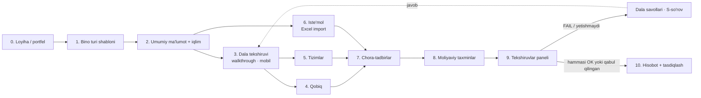
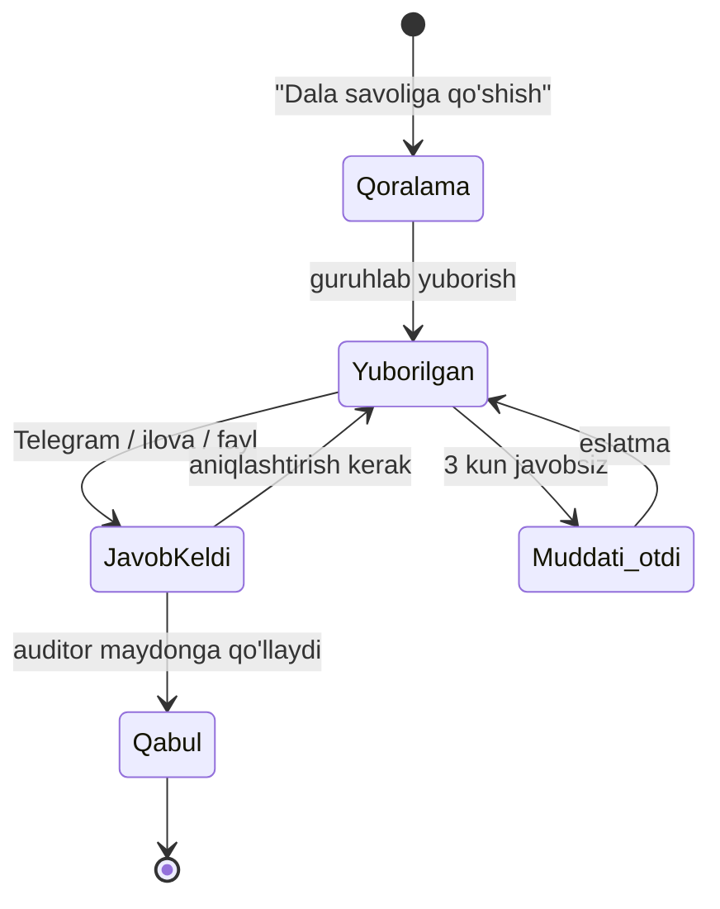
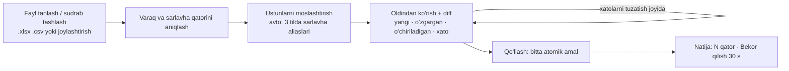

# 03 — UX auditi va ma'lumot kiritish oqimining qayta dizayni

> **Holat:** taklif (dizayn hujjati), kod o'zgartirilmagan · **Sana:** 2026-09-27 ·
> **Muallif rol:** Senior Product/UX dizayner (production-tayyorlik jamoasi)
>
> **Manbalar:** `apps/web/src/**` (routes, building-detail/*, envelope-editor/*, labels.ts,
> i18n), `packages/ui/src/components/*`, `docs/ui-guidelines.md`, `.claude/rules/*`,
> `PROGRESS.md` ("Ma'lum bo'shliqlar"), `3-MTM/Walkthrough EA 3-DMTT.xlsx` (WB dala anketasi,
> 7 varaq), `3-MTM/3-DMTT v7.20.xlsx` (30 varaq, `Checks`, `Financial parameters`),
> `3-MTM/Energoaudit — aniqlashtirish so'rovi (3-MTM), 2-redaksiya.docx`.
>
> **Cheklov:** topilmalar kodni o'qish asosida. Brauzerda qayta hosil qilinmagan joylar
> "(kod bo'yicha, jonli tasdiqlanmagan)" deb belgilangan.

---

## 0. Qisqacha (TL;DR)

1. **Jimgina ma'lumot yo'qolishi — eng katta xavf.** O'nlik vergul (`12,5`) `Number()`/`parseFloat()`
   orqali `NaN`/`12`/`0` ga aylanadi; tizimlar bo'limida bir kartani saqlash boshqa kartalardagi
   saqlanmagan tahrirlarni o'chiradi; oldin/keyin tab'ini almashtirish ham shunday; qobiq muharriri
   dialogini yopish barcha kiritilganni tasdiqsiz tashlaydi. Ilovada `beforeunload`/`useBlocker`/
   tasdiqlash umuman yo'q.
2. **Oqim yo'q — tab'lar to'plami bor.** Bino sahifasi 6 ta teng huquqli tab; auditor qayerdan
   boshlash, nima yetishmasligi va audit "tayyor"mi — bilmaydi. "Auditni ishga tushirish" tugmasi
   esa mavjud batafsil qobiqni soddalashtirilgan qobiq bilan **almashtiradigan** ustadan o'tadi.
3. **Energoauditning asosiy tushunchalari UI'da yo'q:** taxmin (⚠ taxminiy), manba (smeta/chizma/
   dala/hisob-faktura), dala tekshiruvi (walkthrough), rasm/teplovizor, nazoratlar paneli
   (`Checks`: balans + VM 277 + sanity), "qabul qilingan og'ish" va buyurtmachiga aniqlashtirish
   so'rovi (S-kodlar). Bular 3-MTM ishida Excel + Word + Notion'da qo'lda yuritilmoqda.
4. **Tavsiya:** 11 bosqichli "Audit ish maydoni" (stepper + to'liqlik paneli + avtosaqlash +
   har maydon uchun holat/manba meta-ma'lumoti), mobil "Dala rejimi", "Yetishmayotgan → Dala
   savollari → Telegram" sikli, Excel-first import/eksport, portfel dashboard va rolga qarab
   ko'rinish.

---

## 1. Joriy UI evristik auditi

Jiddiylik: **P0** — ma'lumot yo'qolishi/noto'g'ri natija (production'dan oldin tuzatilsin) ·
**P1** — asosiy vazifani sezilarli qiyinlashtiradi · **P2** — samaradorlik/izchillik ·
**P3** — kosmetik. Evristika: N1 holat ko'rinishi, N2 real dunyo tili, N3 nazorat/erkinlik,
N4 izchillik, N5 xatoning oldini olish, N6 eslash o'rniga tanish, N7 moslashuvchanlik/samaradorlik,
N8 minimalizm, N9 xatodan tiklanish, N10 yordam. M — mobil, K — kiritish samaradorligi.

### 1.1. P0 — ma'lumot yo'qolishi va noto'g'ri raqamlar

| # | Ekran / fayl | Muammo | Evr. | Tavsiya |
|---|---|---|---|---|
| U1 | `systems-tab.tsx` `num()`/`numOrNull()`; `audit.tsx` ConsumptionStep; `building-form-fields.tsx` `parseRequiredNumber` | `type="number"` + `Number()`/`parseFloat()`. uz/ru foydalanuvchi `12,5` yozadi (va iOS/Android ru-lokal klaviaturasi vergul beradi) → brauzerga qarab `""` yoki `12` keladi; tizimlarda `num()` uni **jimgina 0** ga, `numOrNull()` **null** ga aylantiradi. Bino formasida "raqam bo'lishi kerak" degan tushunarsiz xato. | N5, N9, M | Yagona `parseLocaleNumber()` (vergul/nuqta/bo'shliq-mingliklarni qabul qiladi) + `NumberInput` komponenti (`type="text" inputMode="decimal"`). Noto'g'ri qiymat hech qachon 0 ga aylanmasin — maydon ostida inline xato. §6.4 |
| U2 | `systems-tab.tsx` har bir `*Section` `useEffect([systems, scenario])` | Bitta kartani saqlash → `invalidateQueries(["…","systems"])` → barcha 9 karta yangi massiv oladi → boshqa kartalardagi **saqlanmagan qatorlar o'chadi**. "Oldin/Keyin" tab'ini almashtirish ham shunday (kod bo'yicha, jonli tasdiqlanmagan). | N3, N5 | Kartaga "iflos" (dirty) bayroq: iflos bo'lsa server ma'lumoti bilan qayta sinxronlamaslik; tab almashtirishda "Saqlanmagan o'zgarishlar" dialogi; uzoq muddatda — avtosaqlash (§2.3). |
| U3 | `envelope-editor-dialog.tsx` | 4 bosqichli murakkab muharrir **modal dialog** ichida; Esc/tashqariga bosish/"Bekor" → barcha qatlam, maydon, element kiritmalari tasdiqsiz yo'qoladi. Saqlash faqat oxirida, hammasi-yoki-hech narsa (`replaceEnvelope`). | N3, N5, N9 | Qobiqni to'liq sahifaga (`/buildings/$id/envelope`) chiqarish; bosqich bo'yicha qoralama avtosaqlash; yopishda tasdiqlash. |
| U4 | `$buildingId/index.tsx` → `audit.tsx` EnvelopeStep | Asosiy CTA "Auditni ishga tushirish" ustaning 1-qadamiga olib boradi, u **mavjud qobiqni soddalashtirilgan (quick) qobiq bilan almashtiradi**. Ogohlantirish bor, lekin standart yo'l destruktiv. | N5 | Ishga tushirishni alohida "Hisoblash" amaliga aylantirish (to'liqlik paneli ichida). "Tezkor qobiq" faqat qobiq bo'sh bo'lganda taklif qilinsin. |
| U5 | `consumption-tab.tsx` `buildBillGroupsForYear` | Tashuvchining barcha oylarini tozalasangiz, guruh yuborilmaydi → serverdagi eski qiymatlar **qoladi** (kod bo'yicha). Noto'g'ri katak (`NaN`) ham jimgina tashlanadi. | N5, N9 | Bo'sh tashuvchi uchun ham `bills: []` bilan replace yuborish; noto'g'ri kataklarni qizil belgilab saqlashni to'xtatish. |
| U6 | `consumption-tab.tsx` Excel import | 3 yillik fayl import qilinadi, lekin saqlash **faqat faol yil** uchun ("2025 yilni saqlash"). Foydalanuvchi importni saqlangan deb o'ylaydi; boshqa yillar sahifadan chiqqach yo'qoladi. Saqlash tashuvchilar bo'yicha ketma-ket (atomik emas). | N1, N5 | Import → oldindan ko'rish → "N yil, M qatorni saqlash" bitta amal (backend'da `db.batch`). Saqlanmagan yil tab'larida nuqta-indikator. |
| U7 | Butun ilova | O'chirish (chora-tadbir, qator, element) tasdiqsiz va qaytarib bo'lmaydi; `window.confirm`/`useBlocker`/`beforeunload` yo'q. | N3, N9 | Qator o'chirish — 5 soniyalik "Bekor qilish" toast; server obyektini o'chirish — tasdiqlash dialogi; iflos formadan chiqishda router blocker. |

### 1.2. P1 — asosiy vazifa oqimi

| # | Ekran / fayl | Muammo | Evr. | Tavsiya |
|---|---|---|---|---|
| U8 | `$buildingId/index.tsx` | 6 ta teng tab + 3 ta sahifa tugmasi (Audit/Natijalar/Moliya). Tartib, to'liqlik, keyingi qadam ko'rinmaydi. Faol tab URL'da emas — havola yuborib bo'lmaydi, qayta yuklashda "Umumiy"ga qaytadi. | N1, N6 | Bosqichli ish maydoni (§2) + `?step=` search-param. |
| U9 | `building-form-fields.tsx` | Iqlim parametrlari (163 kun, +2 °C, −15 °C, 22/14 °C, 10/14 soat) **qattiq kodlangan standartlar**; tanlangan iqlim mintaqasi/bino turidan olinmaydi. Walkthrough'dagi `Climate data` jadvali maktab (+8 °C) va bog'cha/shifoxona (+12 °C) uchun turli davomiylik/HDD beradi. Standartlar taxmin sifatida belgilanmaydi. | N2, N5 | Bino turi + shahar tanlanganda iqlim qiymatlarini avtomatik to'ldirish, "manba: ShNQ 2.01.01-22" chipi bilan; qo'lda o'zgartirilsa "qo'lda" holati. |
| U10 | Barcha formalar | Validatsiya xatolari forma **pastida ro'yxat** bo'lib chiqadi, maydon yonida emas; fokus xatoli maydonga o'tmaydi. Qobiq muharririda xato qaysi bosqichdaligi ko'rinmaydi. | N9, a11y | Inline xato (`aria-invalid`, `aria-describedby`), birinchi xatoli maydonga fokus, stepper'da xato belgisi. |
| U11 | `systems-tab.tsx` | 9 ta karta, har birida alohida "Saqlash"; qaysi kartada saqlanmagan narsa borligi ko'rinmaydi. Ustun sarlavhalarida birlik ba'zan yo'q (i18n kalitlariga bog'liq). | N1, K | Bitta avtosaqlash + karta sarlavhasida holat (●saqlanmagan / ✓saqlandi / ⚠xato). Har ustunda birlik (`kVt`, `1/soat`, `m³/soat·kishi`). |
| U12 | `envelope-editor/*step.tsx`, `row-card.tsx` | Har element — alohida karta (`RowCard`), 30–100 ta element uchun juda uzun skroll; qatorni nusxalash (duplicate) yo'q; Excel'dan joylashtirish yo'q. 3-MTM'da Envelope varag'ida ~100 qator bor. | K, N7 | Desktop'da zich tahrirlanadigan jadval (DataGrid, §4.3) + "Qatorni nusxalash" + ustunga joylashtirish; mobil'da karta ko'rinishi saqlanadi. |
| U13 | `lib/labels.ts` | Enum yorliqlari (bino turi, tashuvchi, chora-tadbir toifasi, generatsiya turi, **oylar**, `formatYears` → "yr", rol) inglizcha qattiq kodlangan — uz/ru interfeysda aralash til. | N2, N4 | i18n'ga ko'chirish (`enums.json`), `formatYears` → `t("common:years", {count})`. Rus terminlari loyiha egasi ko'rib chiqishi shart (`i18n-and-appearance.md`). |
| U14 | `lib/labels.ts` `formatNumber` | `toLocaleString(undefined, …)` — brauzer lokali, **ilova tili emas**. uz interfeys + en-US brauzer → `1,234.5`; hisobot va ekran turlicha. | N4 | `Intl.NumberFormat(i18n.language)` (§6.4 jadval). |
| U15 | `results.tsx` | Natija qachon hisoblangani ko'rsatiladi, lekin kiritmalar **undan keyin o'zgargan**mi — yo'q. Eskirgan natija bankka yuborilishi mumkin. | N1 | "Natija eskirgan — 3 ta o'zgarish (qobiq, iste'mol) hisoblashdan keyin" banneri + "Qayta hisoblash". |
| U16 | `financial.tsx`, `financial.ts` sxema | Moliyaviy parametrlar (diskont, inflatsiya, eskalatsiya, kurs, eksport tarifi, bazaviy yil) loyiha darajasida tahrirlanmaydi — global `energyTariff`. 3-MTM `Financial parameters` varag'ida 20 parametr, har biri manba bilan. | N7 | "Moliyaviy taxminlar" bosqichi (§2, 9-bosqich) — loyiha bo'yicha override + manba + ⚠ belgisi. |
| U17 | Ma'lumot modeli | Bino uchun rasm/fayl biriktirish, taxmin bayrog'i, manba, mas'ul shaxs (assignee), dala tekshiruvi — **sxemada yo'q** (faqat chat biriktirmalari va `reportAnnotation`). | — | §2.2 "Maydon meta-ma'lumoti" va §3 modellari (backend ishi, `docs/production/` boshqa hujjatlari bilan kelishilsin). |
| U18 | `$buildingId/index.tsx` | Rol nishoni `{role} {t("detail.access")}` — "editor ruxsat" (rol nomi tarjima qilinmagan). | N2 | `t("sharing.role_"+role)`. |

### 1.3. P2–P3 — samaradorlik, mobil, izchillik

| # | Ekran / fayl | Muammo | Jiddiylik | Tavsiya |
|---|---|---|---|---|
| U19 | `button.tsx` `sm: h-9`, jadval ichidagi `Input h-9` | Teginish nishoni 36 px (< 44 px), dalada qo'lqop/quyosh ostida qiyin. | P2 (M) | Mobil'da `min-h-11` (44 px) — dala rejimi uchun `size="touch"` varianti. |
| U20 | `consumption-tab.tsx` | 12 oy × 4 tashuvchi gorizontal jadval; telefonda skroll + kichik kataklar. Oylar inglizcha. | P2 (M) | Mobil'da "tashuvchi → oylar ro'yxati" vertikal ko'rinish; desktop'da jadval qoladi. |
| U21 | `audit.tsx` ConsumptionStep vs `consumption-tab.tsx` | Bir xil ma'lumot ikki xil UI bilan kiritiladi (bittalab qo'shish vs yil-jadval). | P2 (N4) | Ustadagi iste'mol qadamini olib tashlab, iste'mol bosqichiga havola. |
| U22 | `new.tsx` | Bitta uzun forma, 20+ maydon, ixtiyoriy/majburiy aralash ("*" belgisi label matnida). Bino turi standart "other". | P2 | Shablon tanlash → minimal majburiy maydonlar → qolgani keyingi bosqichlarda (§2). |
| U23 | `measures-tab.tsx` | Chora-tadbir qo'shish forma pastda; "Tanlovni saqlash" alohida tugma (checkbox'lar avtomatik saqlanmaydi). Investitsiya manbasi (smeta pozitsiyasi) yo'q. | P2 | Checkbox o'zgarishi darhol saqlansin; "Manba: smeta §…" maydoni. |
| U24 | Dashboard/buildings | Mas'ul auditor, keyingi qadam, to'liqlik %, oxirgi dala tashrifi ko'rinmaydi; ommaviy amal yo'q. | P2 | §5 portfel ko'rinishi. |
| U25 | Barcha sahifalar | Bo'sh holatlar matnli ("Hech narsa belgilanmagan"), keyingi harakat tugmasi yo'q. | P3 | EmptyState komponenti: ikon + 1 jumla + asosiy harakat + "Excel'dan import". |
| U26 | `new.tsx` API xatosi | `JSON.stringify(details)` xom JSON foydalanuvchiga ko'rsatiladi. | P3 | Maydon xatolariga xaritalash, qolgani "Texnik tafsilot" yig'iluvchi blokda. |

**Kuchli tomonlar (saqlash kerak):** iste'mol Excel shabloni va 3 tilda sarlavha taniydigan
parser, katakdan Excel'dan joylashtirish (`handleMonthPaste`), qobiq muharririning 4 bosqichli
mantiqiy bo'linishi va U-qiymat jonli ko'rinishi, `AuditorNote` (hisobotga izoh),
skeleton yuklanish holatlari, jadval `whitespace-nowrap` + gorizontal skroll qoidasi, ikki
rejimli navigatsiya, public `verify` sahifasi (QR).

---

## 2. Ma'lumot kiritish bosqichlari — qayta dizayn

### 2.1. Umumiy oqim



Asosiy tamoyillar:

- **Chiziqli emas, yo'naltirilgan.** Stepper tartibni tavsiya qiladi, lekin bloklamaydi: auditor
  iste'molni dala tashrifidan oldin kiritishi mumkin. "Qulflash" faqat hisobot bosqichida
  (P0 xatolar bo'lsa hisobot yakuniy holatga o'tmaydi).
- **Har bosqich = alohida URL** (`/buildings/$id/w/envelope` yoki `?step=envelope`), TanStack
  Router fayl-route'lari. Havola bilan yuborish, orqaga tugmasi, qayta yuklash ishlaydi.
- **Hisoblash — fonda, har doim mavjud.** "Auditni ishga tushirish" ustasi o'rniga to'liqlik
  paneli ichida "Hisoblash" tugmasi; natija eskirganini bildiruvchi banner (U15).
- **"Oldin / Keyin" stsenariysi** — har bosqichda sahifa darajasidagi segment-tugma (hozirgi
  tizimlar tab'idagidek), lekin tahrir holati stsenariy bo'yicha alohida saqlanadi (U2).

### 2.2. Har maydon uchun meta-ma'lumot (yangi tushuncha)

Excel'da auditor buni rang/comment bilan qiladi (3-MTM `CLAUDE.md` §5.1: "⚠ taxminiy",
X-raqam + manba comment'da). Platformada bu birinchi darajali ma'lumot bo'lishi kerak:

| Maydon holati | Belgi | Ma'nosi | Kim o'rnatadi |
|---|---|---|---|
| `empty` | bo'sh, kulrang chiziq | Qiymat yo'q | — |
| `default` | `≈` kulrang | Shablon/me'yor standart qiymati (masalan 163 kun) | tizim |
| `assumed` | `⚠` sariq | Auditor taxmini, tasdiq kutilmoqda | auditor |
| `sourced` | `📎` ko'k chip | Hujjatga bog'langan (smeta §, chizma varag'i, hisob-faktura, VM 277 ilovasi) | auditor |
| `field` | `📷` yashil | Dalada o'lchangan/ko'rilgan, rasm bilan | dala xodimi |
| `confirmed` | `✓` yashil | Buyurtmachi/loyihachi yozma tasdiqlagan (S-so'rov javobi) | rahbar |

Har qiymat yonida: holat belgisi + (ixtiyoriy) manba chipi + izoh. Hover/tap → popover:
"Kim, qachon, manba, oldingi qiymat" (audit izi). Bu Excel'dagi "X98: …" comment'larning
o'rnini bosadi va hisobotdagi "Taxminlar" bo'limini avtomatik quradi (`.claude/rules/
hisobot.md` F bo'limi ❌).

> Backend eslatmasi: umumiy `field_meta(building_id, entity, entity_id, field, status,
> source_ref, note, updated_by, updated_at)` jadvali — har jadvalga ustun qo'shishdan ko'ra
> kamroq invaziv. Bu hujjat faqat UX talabini belgilaydi.

### 2.3. Avtosaqlash qoidasi (barcha bosqichlar)

- Maydon `blur` bo'lganda yoki 800 ms tinchlikdan keyin → PATCH/replace so'rovi. Sarlavha
  yonida: `● Saqlanmoqda…` → `✓ Saqlandi 14:32` → `⚠ Saqlanmadi — qayta urinish`.
- Oflayn (dala): o'zgarishlar navbatga (IndexedDB) yoziladi, `⟳ 3 ta o'zgarish kutmoqda`
  ko'rsatiladi, tarmoq qaytganda yuboriladi. Bu Zustand emas — navbat server holatining
  "optimistik" qismi, TanStack Query mutation persist bilan (`ui-guidelines.md` chegarasi).
- Hammasi-yoki-hech narsa replace endpoint'lari (qobiq, tizimlar) uchun: qoralama butun
  holatda debounce bilan yuboriladi, validatsiyadan o'tmagan qator `draft` bo'lib qoladi va
  hisoblashga kirmaydi (qizil chegara bilan ko'rsatiladi).
- Iflos holatda boshqa route'ga o'tish → router blocker dialogi (U7).

### 2.4. Bosqichlar kartasi

Rollar: **A** — auditor (ofis), **D** — dala xodimi, **R** — loyiha rahbari,
**B** — buyurtmachi/bino egasi, **K** — bank, **E** — regulyator.

| # | Bosqich | Maqsad | Maydon guruhlari | To'liqlik qoidasi (100 % = …) | Kim to'ldiradi |
|---|---|---|---|---|---|
| 0 | Loyiha / portfel | Binoni dastur/lot/buyurtmachiga bog'lash | Dastur (CEBU/WB ECE), lot, buyurtmachi, loyihachi, pudratchi, muddat, mas'ul auditor, dala xodimi | Mas'ul + muddat + buyurtmachi | R |
| 1 | Bino turi shabloni | To'g'ri standartlarni oldindan yuklash | Tur (maktab / MTT / shifoxona / ma'muriy / turar-joy), o'lcham (kichik < 1500 m², o'rta, katta > 4000), "o'xshash binodan klonlash" | Tur tanlangan | A, R |
| 2 | Umumiy ma'lumot | Hisobot muqovasi va iqlim asosi | Identifikatsiya (nom, kod, viloyat/tuman/shahar, manzil, koordinata, Yandex havola); foydalanish (haqiqiy/loyihaviy foydalanuvchi, xodim, smena, ayollar ulushi, ish kuni/soati); geometriya (isitiladigan maydon, hajm, qavat, blok); iqlim (shahar → HDD/CDD, mavsum davomiyligi, harorat — avtomatik) | Majburiy 12 maydon to'lgan va `default` holatidagilar ko'rib chiqilgan | A (B javob beradi) |
| 3 | Dala tekshiruvi | Binoni ko'rib, o'lchab, rasmga olish | Walkthrough anketasi (§2.5), rasm/teplovizor, deraza/eshik inventari yo'nalish bo'yicha, muvofiqlik (eligibility) va seysmik tezkor baho, "yetishmayotgan hujjatlar" ro'yxati | Anketa majburiy bandlari + har konstruksiya turi uchun ≥1 rasm | D (mobil), A tekshiradi |
| 4 | Qobiq | U-qiymat va issiqlik yo'qotish | Bloklar → konstruksiya turlari (qatlamlar) → oyna/eshik turlari → elementlar (yo'nalish, maydon, qo'shni muhit) · oldin/keyin | Har element konstruksiyaga bog'langan; maydon balansi (`Checks` A1: isitiladigan maydon ±1 %) | A |
| 5 | Tizimlar | Energiya balansining uskuna qismi | Isitish generatsiya/taqsimot, IsSuv, ventilyatsiya, sovutish, yoritish, uskunalar, qayta tiklanuvchi · oldin/keyin | Har yakuniy foydalanish (isitish/IsSuv/sovutish/yoritish) uchun ≥1 manba "oldin" stsenariyda | A (D dala ma'lumoti) |
| 6 | Iste'mol | Bazaviy chiziq (baseline) | Oylik hisob-fakturalar tashuvchi × yil (asl birlikda), tarif; Excel import | Har faol tashuvchi uchun ≥12 ketma-ket oy (ideal 36); anomaliya (0 yoki ±3σ) ko'rib chiqilgan | B yuboradi, A kiritadi/import |
| 7 | Chora-tadbirlar | EE/RE va EE bo'lmagan ishlar | Toifa, tavsif, hajm, birlik narx, investitsiya (manba: smeta pozitsiyasi), xizmat muddati, texnik xizmat, "amalga oshirishga tavsiya" | Har chora-tadbir investitsiyasi manbali yoki `⚠`; tanlov saqlangan | A, R |
| 8 | Moliyaviy taxminlar | NPV/IRR asoslari | Bazaviy yil, davr, real diskont, inflatsiya, eskalatsiya (gaz/elektr), kurs, tariflar (VM 243), eksport tarifi | Har parametr manbali | R (A taklif qiladi) |
| 9 | Tekshiruvlar paneli | Hisobotdan oldingi sifat nazorati | A balans, B VM 277 (C1–C20), C sanity (S1–S9), ma'lumot to'liqligi | FAIL yo'q yoki har FAIL "qabul qilingan" + asos | A, R |
| 10 | Hisobot | Bankka/ekspertizaga tayyor PDF | Til, bo'limlar, auditor izohlari, imzo/tasdiqlash, versiya | R tasdiqlagan | R, (B, K, E o'qiydi) |

Har bosqich sahifasi quyidagi **doimiy qismlar**dan iborat:

1. Sarlavha + to'liqlik foizi + avtosaqlash holati.
2. Guruhlangan maydonlar (Card'lar), har guruh sarlavhasida `4/6` hisoblagich.
3. **"Yetishmayotganlar" yon paneli** (desktop — o'ngda; mobil — pastki qism, yig'iluvchi):
   bosqich bo'yicha bo'sh/taxminiy maydonlar ro'yxati, har biriga "o'tish" va "Dala savoliga
   qo'shish" tugmasi (§3).
4. Taxmin/manba belgilari (§2.2) har qiymat yonida.
5. Pastda: "← Oldingi bosqich · Keyingi bosqich →" (klaviatura: `Alt+←/→`).

### 2.5. Dala tekshiruvi (walkthrough) — mobil rejim

Manba: `Walkthrough EA 3-DMTT.xlsx` → `Questionnaire` (1–50 — mas'ul shaxs javob beradi;
51–59 — dala guruhi vizual tekshiradi; 60+ — yetishmayotgan hujjatlar), `Windows and Doors`
(tur × yo'nalish × soni), `Walkthrough EA` (muvofiqlik, seysmik tezkor baho).

Dizayn qarorlari:

- Bir ekranda bitta savol-guruhi (5–8 savol), katta teginish nishonlari (≥ 44 px),
  Ha/Yo'q — segment tugma, tanlov — chip'lar (dropdown emas), raqam — `inputMode="decimal"`.
- Har savolda: "📷 Rasm" (kamera to'g'ridan-to'g'ri `capture="environment"`), "🌡 Teplovizor"
  (fayl + ixtiyoriy min/max °C), "🎙 Ovozli izoh" (keyin), "Bilmayman → dala savoliga".
- Rasm avtomatik meta: vaqt, GPS, qaysi savol/element, yo'nalish (N/E/S/W tanlovi).
  Yuklash orqa fonda, siqilgan preview (`loading="lazy"`, `ui-guidelines.md`).
- Deraza inventari: "Tur qo'shish" (material, oyna turi, balandlik × kenglik → maydon avtomatik)
  keyin yo'nalish bo'yicha `+`/`−` hisoblagich — Excel'dagi "Windows 1..30 × N/E/S/W" jadvali
  o'rniga. Bu to'g'ridan-to'g'ri 4-bosqichdagi oyna turlari va elementlariga oqib o'tadi.
- Oflayn ishlaydi (§2.3), sinxronlanmagan element soni header'da.
- "Plan view" — keyinchalik: rasmga chizish yoki bloklar sxemasi (hozircha rasm yuklash).

**Mobil wireframe (< 640 px):**

```text
┌──────────────────────────────┐
│ ← 3-MTM · Dala        ⟳2  ⋮ │  ← oflayn navbat: 2
├──────────────────────────────┤
│ Dala tekshiruvi      62 % ▓▓▓░│
│ 3/7 · Tashqi devorlar         │
├──────────────────────────────┤
│ Devor izolyatsiyasi bormi?    │
│ [  Ha  ] [ Yo'q ✓ ] [Bilmayman]│
│                               │
│ Devor materiali               │
│ (G'isht✓)(Panel)(Beton)(Boshq)│
│                               │
│ Devor qalinligi, mm           │
│ ┌───────────────────────────┐ │
│ │ 380                    mm │ │ ← inputMode=decimal
│ └───────────────────────────┘ │
│ ⚠ O'lchash paytida rasm oling │
│ [📷 Rasm 2] [🌡 IR 1] [📝]     │
│  ┌──┐┌──┐                     │
│  │▒▒││▒▒│ ← thumbnail         │
│  └──┘└──┘                     │
├──────────────────────────────┤
│ Yetishmayotgan: 4  ▲          │
│ [‹ Oldingi]     [Keyingi ›]   │  ← 44 px, pastki qo'l zonasi
└──────────────────────────────┘
```

### 2.6. Desktop ish maydoni wireframe (≥ 1024 px)

```text
┌────────┬───────────────────────────────────────────────────────────┬──────────────────┐
│Sidebar │ ← Binolar / 3-MTM (bog'cha)   [Oldin|Keyin]  ✓ Saqlandi 14:32 │ To'liqlik   71 % │
│        ├───────────────────────────────────────────────────────────┤ ▓▓▓▓▓▓▓░░░       │
│        │ ①Loyiha ✓ ②Shablon ✓ ③Umumiy ✓ ④Dala 62% ⑤Qobiq 80% ⚠2    │                  │
│        │ ⑥Tizimlar 55% ⑦Iste'mol ✓ ⑧Chora 40% ⑨Moliya ⑩Tekshiruv ⑪Hisobot│ Yetishmayotgan 9 │
│        ├───────────────────────────────────────────────────────────┤ ▸ Qobiq (2)       │
│        │ Qobiq · Elementlar                 [⤓ Excel] [⤒ Import]   │   Pol F3 maydoni │
│        │ ┌─────┬────────┬─────┬──────┬───────┬──────┬──────────┐   │   [→] [?Dala]    │
│        │ │Blok │Element │Yo'n.│Konstr│Maydon │ Holat│  Manba   │   │ ▸ Tizimlar (4)   │
│        │ ├─────┼────────┼─────┼──────┼───────┼──────┼──────────┤   │ ▸ Chora (3)      │
│        │ │A    │Devor N │ N   │W1    │412,6  │ 📎   │Chizma A-1│   │──────────────────│
│        │ │A    │Devor S │ S   │W1    │398,2  │ ⚠    │ taxmin   │   │ Taxminlar  26 ⚠  │
│        │ │Б    │Pol F3  │ —   │F3    │ ___   │ ○    │          │   │ Tekshiruv  4 FAIL│
│        │ └─────┴────────┴─────┴──────┴───────┴──────┴──────────┘   │ Natija: eskirgan │
│        │ + Qator   ⧉ Nusxalash   Σ Jami: 2 518,86 m² (A1 ✓ ±0,1 %)  │ [Hisoblash ▶]    │
│        │                             [‹ Tizimlar ↔ Iste'mol ›]     │                  │
└────────┴───────────────────────────────────────────────────────────┴──────────────────┘
```

`sm`–`lg` (planshet): o'ng panel ish maydoni ustiga tushadigan yig'iluvchi blokka aylanadi
(uchinchi layout rejimi emas — `ui-guidelines.md` qoidasi). Stepper gorizontal skroll qiladi
(`TabsList` bilan bir xil `max-w-full overflow-x-auto` andozasi).

### 2.7. Bosqich tafsilotlari (qisqa)

**1. Shablon.** Tur + o'lcham + shahar → oldindan to'ldiriladi: ichki harorat (maktab 18–20,
MTT 22), ish soatlari (MTT 250 kun × 10 soat), mavsum davomiyligi va HDD (`Climate data`:
maktab +8 °C, MTT/shifoxona +12 °C chegara), odatiy konstruksiya qatlamlari (PROGRESS.md'dagi
"konstruksiya-turi shablon kutubxonasi yo'q" bo'shlig'i shu yerda yopiladi), odatiy dala
anketasi bandlari (masalan shifoxonada "yotoq soni", maktabda "smena"). Hammasi `default`
holatida (≈) — auditor ko'rib chiqmaguncha to'liqlikka "ko'rib chiqilmagan" bo'lib tushadi.

**2. Umumiy.** Majburiy minimal to'plam faqat 12 maydon; qolgani ixtiyoriy, alohida
yig'iluvchi "Qo'shimcha" guruhida. Koordinata — Yandex havolasini joylashtirsa avtomatik
ajratiladi (anketa 16–17-band).

**4. Qobiq.** Sahifa (dialog emas), 4 ichki tab qoladi (bloklar → konstruksiyalar →
oynalar → elementlar). Elementlar — DataGrid. Jonli nazorat: isitiladigan maydon va
hajm balansi (A1/A2), me'yoriy R₀ bilan solishtirish (C6–C8) har konstruksiya kartasida
`R₀ = 3,64 ≥ 3,61 ✓`.

**5. Tizimlar.** 9 karta → chap tomonda ichki navigatsiya (Isitish · IsSuv · Ventilyatsiya ·
Sovutish · Yoritish · Uskunalar · QTE), bitta avtosaqlash. Dala anketasi javoblari
(qozon quvvati "50×10 kW", LED ulushi, konditsioner soni) taklif sifatida ko'rsatiladi:
"Dalada: 2 ta konditsioner — qo'shish?".

**6. Iste'mol.** §4.1 import oqimi. Grafik (mavjud `consumption-comparison-chart`) tepada,
anomaliya belgilari bilan; to'liqlik: yil × tashuvchi matritsasi (`■` to'liq, `▢` qisman, `·` yo'q).

**7. Chora-tadbirlar.** Jadval + o'ng panelda tanlangan chora-tadbir tafsiloti (tejamkorlik
standardized/actual juftligi — `hisobot.md` ikkinchi qoidasi). "Smeta pozitsiyasi" maydoni
(masalan "Ю КГ 3, ЕЕ 34–60-q.") — manba chipi. EE bo'lmagan ishlar alohida tab.

**8. Moliya.** `Financial parameters` varag'i shakli: parametr · birlik · qiymat · manba ·
holat. Loyiha standartlari tashkilot darajasidan meros, override qilinsa `⚠` ko'rinadi.

**10. Hisobot.** Oldindan ko'rish, bo'lim tanlovi, "yakuniy" holatga o'tkazish faqat R
roliga va P0 tekshiruvlar yopilgandan keyin; yakuniy versiya muzlatiladi (3-MTM `v7.NN`
"muzlatilgan" tamoyilining platformadagi ekvivalenti — "Versiya 7 · 27.09.2026 · muzlatilgan").

---

## 3. "Audit to'liqligi" paneli va "Yetishmayotgan → Dala savollari"

### 3.1. To'liqlik qanday hisoblanadi

To'liqlik — bitta foiz emas, uchta alohida o'lcham (ularni aralashtirish chalg'itadi):

| O'lcham | Formula | Ko'rinish |
|---|---|---|
| **Qamrov** (coverage) | to'ldirilgan majburiy maydonlar ÷ bosqichning majburiy maydonlari (bosqich qoidasi §2.4) | halqa + % har bosqichda |
| **Ishonchlilik** (confidence) | `sourced`+`field`+`confirmed` ÷ to'ldirilganlar; `assumed` va ko'rib chiqilmagan `default` pasaytiradi | "Taxminlar: 26 ⚠" hisoblagich |
| **Tekshiruv** (checks) | A/B/C nazoratlaridan OK / NOTE / FAIL / FAIL-qabul qilingan | svetofor: `13 OK · 1 NOTE · 4 FAIL(qabul)` |

Og'irliklar bosqich bo'yicha (qobiq va iste'mol energobalansga eng ko'p ta'sir qiladi):
Umumiy 10 · Dala 15 · Qobiq 25 · Tizimlar 20 · Iste'mol 15 · Chora 10 · Moliya 5. Umumiy
foiz faqat **qamrov** bo'yicha; ishonchlilik va tekshiruv alohida ko'rsatiladi.

"Hisobotga tayyor" darajalari: 🔴 **Qoralama** (qamrov < 80 %) → 🟡 **Hisoblash mumkin**
(barcha majburiy energobalans kiritmalari bor) → 🟢 **Hisobotga tayyor** (FAIL yo'q yoki har
biri qabul qilingan + asos, P0 taxminlar yo'q) → 🔒 **Tasdiqlangan** (R imzolagan).

### 3.2. Tekshiruvlar paneli (9-bosqich)

`3-DMTT v7.20.xlsx → Checks` varag'ining platforma ekvivalenti — 3 guruh:

| Guruh | Misol | Manba |
|---|---|---|
| A. Ichki balans | A1 isitiladigan maydon ±1 %, A3/A4 ulushlar = 1, A6/A7 baseline = hisob-faktura, A10/A11 jami = qatorlar yig'indisi | dvigatel natijasi |
| B. Me'yoriy (VM 277) | C1 FES ≥ 50 % elektr, C2 quyosh kollektori ≥ 60 % IsSuv, C3 COP ≥ 3, C6–C8 R₀, C9 deraza U ≤ 1,38, C20 EE toifa ≥ C | me'yor jadvali (versiyalangan) |
| C. Sanity | S1 solishtirma isitish 30–60, S3 solishtirma investitsiya 200–300 USD/m², S4 qoplanish 8–20 yil, S5 IN quvvati 45–65 Vt/m² | tajriba oraliqlari (sozlanadigan) |

Har qator: `# · Tekshiruv · Hisoblangan · Talab · Natija · Izoh · [Manba katakka o'tish]`.
**FAIL uchun ikki harakat:** "Tuzatish" (tegishli bosqich va maydonga o'tadi) yoki "Qabul
qilish" — majburiy asos matni + qaror sanasi + kim (3-MTM: "FAIL ACCEPTED: windows are NOT
replaced… foydalanuvchi qarori 27.09"). Qabul qilingan FAIL hisobotda "Qabul qilingan
og'ishlar" jadvalida chiqadi — bank va regulyator uni ko'rishi kerak.

### 3.3. Yetishmayotgan ma'lumotlar → dala savollari

3-MTM'da bu jarayon qo'lda: Word hujjati "Aniqlashtirish so'rovi" (19 masala, S1…S34 kodlar,
ustuvorlik, "Nima aniqlandi / Nima uchun muhim / Auditda qabul qilingan / So'rov"),
Notion "Ma'lumotlar (so'rovlar va topshirilganlar)" bazasi, walkthrough'dagi "Missing
Information" bloki. Platformada bitta obyekt — **Savol (Query)**:

| Maydon | Misol |
|---|---|
| Kod | `S27` (bino ichida avtomatik raqam) |
| Bog'langan maydon(lar) | Qobiq › Konstruksiya F3 › Qatlam 2 › λ |
| Turi | Hujjat so'rovi / o'lchov / tasdiq / narx |
| Ustuvorlik | yuqori / o'rta / past (ta'sir kWh yoki USD bo'yicha avtomatik taklif) |
| Nima aniqlandi · Nima uchun muhim | matn |
| Auditda qabul qilingan qiymat | `0,76 Vt/(m·°C)` — maydon hozircha `assumed` |
| Kimga | dala xodimi / buyurtmachi / loyihachi (+ kontakt) |
| Kanal | ilova ichida · Telegram · Email · Word/PDF so'rov |
| Holat | qoralama → yuborilgan → javob keldi → qabul qilindi / rad etildi → yopilgan |
| Javob | matn / raqam / fayl / rasm — qabul qilinganda maydonga yoziladi va holati `confirmed`/`field` bo'ladi |



**Yaratish usullari:** (1) istalgan maydon popover'idan "?" → savol; (2) yetishmayotganlar
panelidan bir nechtasini belgilab "Savollar ro'yxati yaratish"; (3) tekshiruv FAIL'idan;
(4) avtomatik taklif — bosqich yakunlanganda bo'sh qolgan majburiy maydonlar.

**Chiqish formatlari:**
- **Dala xodimiga (Telegram):** qisqa, bittadan savol, tugmali javob. Bot savolni yuboradi,
  xodim raqam/rasm/ovoz bilan javob beradi, javob "JavobKeldi" holatida auditor navbatiga
  tushadi (avtomatik qo'llanmaydi — inson tasdig'i shart).
- **Buyurtmachiga (rasmiy):** tanlangan savollardan 2-redaksiya uslubidagi Word/PDF so'rov
  generatsiyasi (sarlavha, joriy natija jadvali, yopilgan masalalar, ustuvorlik bo'yicha
  guruhlangan savollar). Redaksiya raqami va "1-redaksiyadan beri yopilganlar" avtomatik.

**Telegram xabari namunasi (dala xodimi):**

```text
🏫 3-MTM · Yuqorichirchiq  ·  S33 (o'rta)
B o'qi bo'ylab kanal: uzunligi va vazifasi?
Hozir auditda: 13,25 m (taxmin)
[✅ To'g'ri]  [✏️ Raqam yuborish]  [📷 Rasm]  [❓ Bilmayman]
Muddat: 30.09 · Javob ilovada ko'rinadi → yres.saidmurod.com/b/…/q/S33
```

Xavfsizlik/qoidalar: bot faqat binoga a'zo (editor) foydalanuvchiga va Telegram akkaunti
profilda bog'langan shaxsga yozadi; Telegram'dan kelgan matn **ma'lumot, buyruq emas**
(TelegramHub `CLAUDE.md` qoidasi bilan bir xil); ommaviy yuborish yo'q; har yuborish audit
log'ida. Birinchi bosqichda ilova ichidagi bildirishnoma + chat (mavjud Durable Objects)
yetarli, Telegram — ikkinchi bosqich.

### 3.4. To'liqlik paneli wireframe (o'ng panel, kengaytirilgan)

```text
┌────────────────────────────────────┐
│ Audit to'liqligi         🟡        │
│ Hisoblash mumkin · hisobotga emas  │
│ Qamrov      ▓▓▓▓▓▓▓▓░░  82 %       │
│ Ishonch     ▓▓▓▓▓▓░░░░  61 %  ⚠26  │
│ Tekshiruv   13 ✓ · 1 ● · 4 ✗(qabul)│
├────────────────────────────────────┤
│ Bosqichlar                          │
│  Umumiy        ✓ 100               │
│  Dala          ◔  62  📷 14 rasm   │
│  Qobiq         ◕  80  ⚠2           │
│  Tizimlar      ◑  55               │
│  Iste'mol      ✓ 100  36 oy        │
│  Chora         ◔  40               │
├────────────────────────────────────┤
│ Hisobotni bloklaydi (3)             │
│  ✗ Pol F3 maydoni yo'q      [→]    │
│  ⚠ BEMS narxi taxmin (37 783) [?]  │
│  ✗ S4 qoplanish 41 y > 20 [asos]   │
├────────────────────────────────────┤
│ Ochiq savollar  7 · muddati o'tgan 2│
│ [Savollar ro'yxati] [Telegramga ▸] │
└────────────────────────────────────┘
```

---

## 4. Excel/CSV import-eksport, ommaviy tahrir, klonlash

Auditorlar Excel'da o'ylaydi (3-MTM: 30 varaqli model, `v7.01…v7.20`). Maqsad — Excel'ni
**taqiqlash emas, ko'prik qilish**: istalgan jadval Excel'ga chiqadi va qaytib kiradi.

### 4.1. Import oqimi (barcha jadvallar uchun bir xil)



Qoidalar:
- **Oldindan ko'rish majburiy**, "import qilindi = saqlandi" (U6 ning teskarisi). Diff
  rangli: yashil yangi, sariq o'zgargan (eski → yangi), qizil xato (sabab bilan).
- **Birlik va lokal:** `12,5` va `12.5`, `1 234,5` va `1,234.5` ikkalasi qabul qilinadi;
  noaniq holatda (masalan `1,234`) foydalanuvchidan ustun bo'yicha bir marta so'raladi.
  Asl birlik ustuni (m³/Gkal/t/kWh) — mavjud `consumption-units.ts` mantiqi saqlanadi.
- **Manba avtomatik:** import qilingan qiymatlar `sourced` holatini oladi, manba = fayl nomi
  + varaq + katak (masalan `3-DMTT v7.20.xlsx › Consumption!M19`) — Excel'dagi audit izi
  yo'qolmaydi.
- **Qisman import:** xatoli qatorlarni o'tkazib yuborib qolganini qo'llash mumkin, lekin
  o'tkazib yuborilganlar ro'yxati yuklab olinadi (CSV).
- Katta fayl: fon ishi + progress; brauzerda parse (mavjud `xlsx` yondashuvi), serverga
  faqat tozalangan JSON.

**Import manbalari (ustuvorlik bo'yicha):** (1) iste'mol — mavjud, kengaytiriladi;
(2) qobiq elementlari va oyna inventari; (3) chora-tadbirlar ro'yxati smetadan
("Ю КГ 3" — pozitsiya, hajm, narx → chora-tadbirga xaritalash); (4) WB walkthrough anketasi
(`Questionnaire` + `Windows and Doors` varaqlari → 2- va 3-bosqich); (5) to'liq WB shabloni
(`3-DMTT` tuzilmasi) — eng qimmat, keyinroq.

### 4.2. Eksport

- Har jadval: "⤓ Excel" (joriy filtr bilan), sarlavhalar joriy tilda + yashirin mashina
  kalitlari qatori (qayta import uchun), holat/manba ustunlari bilan.
- Bino bo'yicha: "To'liq ish kitobi" — har bosqich alohida varaq, WB shablon varaq nomlari
  bilan (`Building_data`, `Envelope`, `Consumption`, …) — auditor tekshirish uchun Excel'da
  ochadi. Portfel bo'yicha: `Summary` varag'i shaklidagi jamlanma (1 qator = 1 bino).

### 4.3. Ommaviy tahrir (DataGrid)

Qobiq elementlari, oyna inventari, yoritish zonalari, uskunalar, chora-tadbirlar, iste'mol
uchun bitta `DataGrid` komponenti (`packages/ui`ga yangi primitiv; Tailwind `@source`
qoidasi va quriladigan CSS tekshiruvi — `frontend.md`):

| Imkoniyat | Klaviatura / harakat |
|---|---|
| Katak navigatsiyasi | strelkalar, `Tab`/`Shift+Tab`, `Enter` pastga |
| Excel'dan blok joylashtirish | `Ctrl/⌘+V` — TSV, ko'p qator × ko'p ustun (mavjud `handleMonthPaste` umumlashtiriladi) |
| To'ldirish pastga | `Ctrl+D` (tanlangan diapazon) |
| Qatorni nusxalash | `Ctrl+Shift+D` / "⧉" |
| Ko'p qator tanlab o'zgartirish | checkbox + "Tanlanganlarga: Konstruksiya = W1" |
| Bekor qilish / qaytarish | `Ctrl+Z` / `Ctrl+Shift+Z` (grid ichidagi lokal tarix) |
| Birlik | ustun sarlavhasida, katakda emas |
| Hisoblangan ustun | kulrang fon, tahrirlanmaydi (Excel "hisob = accent3" legendasi) |
| Jami qatori | pastda yopishqoq, nazorat bilan (A1 ±1 %) |

`whitespace-nowrap` + gorizontal skroll (`frontend.md` jadval qoidasi) saqlanadi; birinchi
ustun yopishqoq. 50+ qator — `@tanstack/react-virtual` (`ui-guidelines.md`). Mobil'da grid
emas, karta ro'yxati (hozirgi `RowCard` shu yerda o'rinli).

### 4.4. Klonlash ("o'xshash binodan")

50+ korxonali WB loyihasida binolar takrorlanadi (bir turdagi maktab/MTT loyihalari).

- **Qayerdan:** bino kartasi `⋮ → Nusxa ko'chirish`, yoki yangi bino yaratishda "Shablon:
  mavjud binodan".
- **Nimani (checkbox bilan):** ☑ umumiy parametrlar (nom/manzil/koordinatasiz) · ☑ konstruksiya
  turlari va qatlamlar · ☐ qobiq elementlari (geometriya) · ☑ tizimlar · ☐ iste'mol (hech
  qachon standart emas — boshqa bino hisob-fakturasi) · ☑ chora-tadbirlar (narxlarsiz yoki
  narx bilan) · ☑ moliyaviy taxminlar · ☐ rasmlar/savollar.
- Klonlangan barcha qiymatlar **`default` holatida, manba = "3-MTM dan klon"** — auditor
  ko'rib chiqmaguncha ishonchlilikka kirmaydi. Bu nusxalangan xato binodan binoga jimgina
  ko'chishining oldini oladi (2-redaksiya S1: "muhandislik ro'yxati bir blokdan ikkinchisiga
  nusxalangan" — xuddi shu xato turi).
- **Portfel darajasidagi shablon:** tashkilot "maktab 1990-yillar g'isht" kabi shablonlarni
  saqlaydi (1-bosqich tanlovida chiqadi).

---

## 5. Portfel dashboard (50+ korxona bir vaqtda)

Joriy `dashboard.tsx`: 2–4 MetricCard, hudud grafigi, qidiruv + tur/holat/hudud filtri,
jadval (nom, joylashuv, holat, auditorlar soni, boshlangan, muddat). Yetishmaydi:
mas'ul, bosqich, to'liqlik, ochiq savollar, dala tashrifi, ommaviy amal, saqlangan
ko'rinishlar. `dashboard.md` qoidalari (`pageSize: 100` cheklovi, `building.status` —
`auditRun`dan mustaqil) saqlanadi; 50+ bino uchun aggregatsiya serverga ko'chishi kerak.

### 5.1. Wireframe (desktop)

```text
┌──────────────────────────────────────────────────────────────────────────────────────┐
│ Portfel: WB ECE · CEBU 2026                    [Ko'rinish: Mening binolarim ▾] [⤓]  │
├───────────┬───────────┬───────────┬───────────┬───────────┬───────────────────────────┤
│ Jami 54   │ Dalada 12 │ Qobiq/tiz.│ Tekshiruv │ Tayyor 9  │ ⚠ Muddati o'tgan 5       │
│           │           │   18      │   10      │ ✓ Tasd. 5 │ ⏳ 7 kun ichida 8          │
├───────────┴───────────┴───────────┴───────────┴───────────┴───────────────────────────┤
│ Funnel:  Dala ▇▇▇▇ 12 → Kiritish ▇▇▇▇▇▇ 18 → Tekshiruv ▇▇▇ 10 → Hisobot ▇▇ 9 → ✓ 5 │
├──────────────────────────────────────────────────────────────────────────────────────┤
│ 🔍 Qidiruv  [Viloyat▾] [Tur▾] [Bosqich▾] [Mas'ul▾] [Muddat▾] [Faqat bloklanganlar ☐] │
├──┬───────────────┬──────────┬──────────┬─────────┬───────┬──────┬───────┬────────────┤
│☐ │ Bino          │ Viloyat  │ Mas'ul   │ Bosqich │ To'l. │ Savol│ Muddat│ Keyingi     │
├──┼───────────────┼──────────┼──────────┼─────────┼───────┼──────┼───────┼────────────┤
│☐ │ 3-MTM (MTT)   │ Toshkent │ S.Xamdam.│ ⑩Tekshir│ 82 %  │ 7(2!)│ 30.09 │ S4 asos    │
│☐ │ 15-maktab     │ Qoraqalp.│ A.Karimov│ ④Dala   │ 34 %  │ 3    │ ⚠12.09│ Dala: tom  │
│☐ │ Kardiologiya  │ Toshkent │ —        │ ②Umumiy │ 12 %  │ 0    │ 15.10 │ Mas'ul yo'q│
└──┴───────────────┴──────────┴──────────┴─────────┴───────┴──────┴───────┴────────────┘
 Tanlangan 3:  [Mas'ul tayinlash] [Muddat] [Holat] [Savollarni Telegramga] [⤓ Summary]
```

Tafsilotlar:
- **Bosqich** — §2.4 dagi 0–10 bosqichlardan eng birinchi tugallanmagani (hisoblanadi,
  qo'lda emas); `building.status` (qo'lda loyiha holati) alohida ustun sifatida qoladi —
  ikkalasi aralashtirilmaydi (`dashboard.md`).
- **Keyingi** — to'liqlik panelidagi birinchi bloklovchi band (bir qatorli matn).
- Saqlangan ko'rinishlar: "Mening binolarim", "Bu hafta dala", "Bloklangan", "Bankka tayyor";
  filtrlar URL search-param'larida (havola bilan ulashish).
- Muqobil ko'rinishlar: **Kanban** (ustun = bosqich, kartani sudrash yo'q — bosqich
  hisoblanadi, faqat ko'rish), **Xarita** (koordinata bor binolar, rang = bosqich),
  **Kalendar** (dala tashriflari va muddatlar).
- Mobil (< 640 px): jadval o'rniga karta ro'yxati (nom, bosqich, to'liqlik halqasi, muddat);
  filtrlar pastdan chiquvchi panelda (hozircha `Dialog` bilan — `Sheet` komponenti yo'q,
  `frontend.md`).
- Rahbar uchun: auditorlar kesimida yuklama (binolar soni × bosqich) — kichik jadval.

---

## 6. Dizayn tizimi qoidalari

`docs/ui-guidelines.md` asos bo'lib qoladi; bu bo'lim faqat ma'lumot-kiritish uchun qo'shimchalar.

### 6.1. Tokenlar

Yangi token — oxirgi chora (`ui-guidelines.md` §3). Mavjudlarga xaritalash:

| Semantika | Token | Qo'llanish |
|---|---|---|
| Taxmin (`assumed`) | `warning` (mavjud) | `⚠` belgisi, katak chap chegarasi 2 px |
| Manbali (`sourced`) | `primary` / `accent` | manba chipi |
| Dala (`field`), tasdiqlangan | `success` (mavjud) | `📷`/`✓` |
| Standart (`default`) | `muted-foreground` | `≈` va kursiv qiymat |
| Xato / FAIL | `destructive` | inline xato, FAIL qatori |
| Hisoblangan (read-only) katak | `muted` fon | Excel "hisob" legendasiga mos |
| **Yangi (taklif):** `--color-info` | faqat "qabul qilingan og'ish" va NOTE holati uchun zarur bo'lsa, light+dark ikkalasida | tekshiruv paneli |

Holatni **faqat rang bilan** bildirmaslik — har doim belgi + matn (rang ko'rish buzilishi,
chop etilgan hisobot, quyosh ostidagi ekran).

### 6.2. Yangi/o'zgartiriladigan komponentlar (`packages/ui`)

| Komponent | Vazifasi | Eslatma |
|---|---|---|
| `NumberInput` | `type="text" inputMode="decimal"`, lokal bo'yicha parse/format, birlik suffiksi, min/max, `aria-invalid` | U1 ni yopadi; barcha raqam maydonlari shunga o'tadi |
| `UnitField` | Label + NumberInput + birlik + FieldMeta | forma qatorining standart shakli |
| `FieldMeta` | holat belgisi + popover (manba, kim, qachon, izoh, tarix, "?" savol) | §2.2 |
| `SourceChip` | "Smeta Ю КГ 3 §34", "Chizma A-1", "VM 277 6-ilova" | bosilsa fayl/havolani ochadi |
| `Stepper` | bosqichlar, holat (✓/%/⚠), gorizontal skroll | qobiq muharriri va ish maydoni |
| `CompletenessRing` / `ProgressBar` | foiz + rang | mavjud `progress.tsx` kengaytiriladi |
| `DataGrid` | §4.3 | virtualizatsiya, klaviatura |
| `ImportWizard` | §4.1 | barcha jadvallar uchun umumiy |
| `SaveStatus` | `● Saqlanmoqda / ✓ Saqlandi / ⚠ Xato / ⟳ N navbatda` | sahifa sarlavhasida |
| `EmptyState` | ikon + matn + asosiy harakat + import | U25 |
| `ConfirmDialog` + `UndoToast` | o'chirish/chiqish | U7 |
| `PhotoCapture` | kamera, preview, meta, orqa fonda yuklash | dala rejimi |
| `Sheet` (pastdan/yondan panel) | mobil filtr, to'liqlik paneli | hozircha yo'q — Radix Dialog ustida yupqa o'ram, `@source` tekshiruvi bilan |

Har yangi komponentdan keyin: `bun run build` + quriladigan CSS'da klass borligini `grep`
bilan tekshirish (`frontend.md` — bu repo'dagi eng qimmat nozik jihat).

### 6.3. Holatlar (har ekran uchun majburiy)

| Holat | Qoida |
|---|---|
| Yuklanish | Skeleton — oxirgi layout shaklida (mavjud andoza); 300 ms dan qisqa bo'lsa ko'rsatilmaydi |
| Bo'sh | EmptyState: nima uchun bo'sh + birinchi harakat + "Excel'dan import" + (ixtiyoriy) "o'xshash binodan" |
| Qisman | Yetishmayotganlar paneli; bo'sh majburiy maydon ingichka `warning` chegara, lekin qizil emas (xato emas — hali to'ldirilmagan) |
| Validatsiya xatosi | Maydon ostida, aniq sabab + to'g'ri misol ("Vergul yoki nuqta: 12,5"); birinchisiga fokus |
| Saqlash xatosi | Ma'lumot lokal saqlanib qoladi, "Qayta urinish"; hech qachon kiritilganni tashlamaslik |
| Oflayn | Header'da `⟳ N` + "Oflayn — o'zgarishlar saqlanadi va keyin yuboriladi" |
| Faqat o'qish | Maydonlar matn sifatida (disabled input emas — kontrast va o'qilishi yaxshi), yuqorida nishon |
| Eskirgan natija | Natija/moliya/hisobot sahifalarida sariq banner + "Qayta hisoblash" |
| Ruxsat yo'q / topilmadi | Mavjud xato kartasi + "Binolarga qaytish" |

### 6.4. Raqam, birlik, sana formatlash

Yagona manba — `lib/labels.ts` (`frontend.md`), lekin lokal **ilova tilidan** olinadi
(`i18n.language`), brauzerdan emas (U14).

| | uz | ru | en |
|---|---|---|---|
| O'nlik ajratgich | `,` | `,` | `.` |
| Minglik ajratgich | bo'shliq (`2 518,86`) | bo'shliq (`2 518,86`) | `,` (`2,518.86`) |
| Valyuta | `975 113 USD` · `2 000 so'm` | `975 113 USD` · `2 000 сум` | `USD 975,113` · `UZS 2,000` |
| Sana | `27.09.2026` | `27.09.2026` | `27 Sep 2026` |
| Foiz | `91,9 %` | `91,9 %` | `91.9%` |
| Yil (muddat) | `41,0 yil` | `41,0 лет` (i18next plural) | `41.0 yr` |
| Birliklar | `kVt·soat/yil`, `m²`, `Vt/(m²·K)`, `m³/soat` | `кВт·ч/год`, `м²`, `Вт/(м²·К)` | `kWh/y`, `m²`, `W/(m²·K)` |

Qoidalar:
- **Kiritishda** har ikki ajratgich qabul qilinadi; bitta ajratgich + aniq 3 raqam
  (`1,234`) — uz/ru'da o'nlik deb, en'da minglik deb talqin qilinadi va maydon ostida
  talqin ko'rsatiladi ("= 1,234").
- **Aniqlik** o'lchamga qarab: maydon m² — 2 xona, energiya kWh/y — 0 xona, solishtirma
  kWh/m²·y — 1–2 xona, U — 2–3 xona, USD — 0 xona (jadval), 2 xona (birlik narx).
- Birlik **label/sarlavhada**, qiymat ichida emas; hisobotdagi birlik yozuvi bilan bir xil
  (bank ekran va PDF'ni solishtiradi). Birlik tarjimasi — loyiha egasi ko'rib chiqadi.
- Raqamli ustunlar o'ngga tekislanadi, `tabular-nums`.
- Manfiy qiymat: `−29,02` (haqiqiy minus belgisi), qizil emas (FES eksporti — yaxshi natija).

### 6.5. Accessibility

- Har input `Label htmlFor` bilan (mavjud andoza yaxshi); xato `aria-describedby`,
  `aria-invalid`; to'liqlik halqasi `role="progressbar" aria-valuenow`.
- Kontrast ≥ 4.5:1 (matn), ≥ 3:1 (chegara/ikon) — light va dark ikkalasida tekshiriladi.
- Fokus ko'rinadi (mavjud `focus-visible:ring-2` saqlanadi); dialog ichida fokus tuzog'i
  (Radix), yopilganda chaqirgan tugmaga qaytadi.
- Klaviatura bilan to'liq ishlash: stepper, DataGrid, import ustasi.
- Faqat ikonli tugmalarda `aria-label` (mavjud andoza) + tooltip.
- Harakat animatsiyalari `prefers-reduced-motion` ga bo'ysunadi.

### 6.6. Mobil qoidalari

- Breakpoint'lar va ikki rejimli navigatsiya o'zgarmaydi (`ui-guidelines.md`).
- Dala rejimi ekranlarida teginish nishoni ≥ 44 px, asosiy harakatlar pastki qismda
  (bir qo'l zonasi), yopishqoq pastki panel.
- Kamera `capture="environment"`; rasm yuklashdan oldin brauzerda siqish (≤ 1600 px).
- Mobil'da jadval → karta ro'yxati; tahrir faqat bitta yozuv bo'yicha.
- Klaviatura turi: `inputMode="decimal"` (raqam), `"tel"`, `"email"`; `enterKeyHint="next"`.
- Quyosh ostida: yuqori kontrastli light tema, kichik kulrang matn yo'q.

---

## 7. Rollarga qarab interfeys

Hozir ikki mustaqil tizim bor: global `user.role` (`admin | auditor | viewer`) va bino
bo'yicha `buildingMember.role` (`owner | editor | viewer`) — `social-features.md`. Tashkilot
modeli yo'q (PROGRESS.md "Ma'lum bo'shliqlar"). Taklif — **ko'rish rejimi** (persona) bino
a'zoligi ustiga qo'shiladi, yangi ruxsat tizimi emas:

| Imkoniyat | Auditor | Dala xodimi | Rahbar | Buyurtmachi | Bank | Regulyator |
|---|---|---|---|---|---|---|
| Asosiy sahifa | Ish maydoni (mening binolarim) | Dala rejimi (bugungi tashriflar) | Portfel dashboard | Mening binolarim (holat) | Portfel (faqat tayyor/tasdiqlangan) | Reestr (tasdiqlangan hisobotlar) |
| Kiritish bosqichlari | ✏️ hammasi | ✏️ 3-bosqich + unga yuborilgan savollar | ✏️ 0, 8, 10; boshqalari 👁 | ❌ (faqat savollarga javob) | ❌ | ❌ |
| Taxmin/manba belgilari | ✏️ | ✏️ (dala) | ✏️ tasdiqlash | 👁 | 👁 (yig'ma) | 👁 |
| Savollar | yaratadi, qabul qiladi | javob beradi | ko'rib chiqadi | javob beradi (hujjat yuklaydi) | ❌ | ❌ |
| Tekshiruvlar | 👁 + tuzatish | ❌ | FAIL'ni qabul qilish (asos bilan) | 👁 xulosa | 👁 to'liq + qabul qilingan og'ishlar | 👁 VM 277 bloki |
| Natija/moliya | 👁 to'liq | ❌ | 👁 | 👁 xulosa (tejash, investitsiya, qoplanish) | 👁 NPV/IRR, standardized ↔ actual, sezgirlik | 👁 EE toifa, CO₂, ZEB |
| Hisobot | qoralama | ❌ | yakunlaydi/imzolaydi | yuklab oladi | yuklab oladi + `verify` QR | yuklab oladi + `verify` |
| Eksport | Excel to'liq | ❌ | Excel + Summary | PDF | PDF + Summary | PDF + reestr CSV |

Dizayn qoidalari:
- Bir xil ma'lumot — turli **zichlik**: auditor — xom kiritmalar; bank — standardized/actual
  juftligi va taxminlar ro'yxati (hech qachon faqat bittasi — `hisobot.md`); buyurtmachi —
  3–5 KPI + "sizdan kutilayotgan: 4 ta savol".
- Faqat-o'qish rollarida tahrir elementlari umuman chizilmaydi (disabled emas).
- Bank/regulyator uchun "Taxminlar va qabul qilingan og'ishlar" bloki har doim ko'rinadi —
  ishonchlilik shu yerdan quriladi.
- Dala xodimi uchun alohida yengil kirish: Telegram orqali bir martalik havola (keyingi
  bosqich); hozircha oddiy `editor` a'zolik + dala rejimiga standart yo'naltirish.
- Rol almashtirgich (bir odamda bir nechta rol): profil menyusida "Ko'rinish: Auditor ▾".

---

## 8. Amalga oshirish tartibi (UX nuqtai nazaridan)

| Bosqich | Tarkib | Topilmalar |
|---|---|---|
| **P0 — production'dan oldin (1–2 hafta)** | `parseLocaleNumber` + `NumberInput`; tizimlar kartalarida dirty-himoya; qobiq dialogi va barcha formalarda chiqishdan oldin tasdiq; iste'molda bo'sh tashuvchini o'chirish va ko'p yilli saqlash; o'chirishga tasdiq/undo; "Auditni ishga tushirish" → qobiqni almashtirmaydigan "Hisoblash" | U1–U7 |
| **P1 — oqim (3–5 hafta)** | Bosqichli ish maydoni + URL; to'liqlik paneli (qamrov); natija eskirganligi; inline validatsiya; enum/oy/birlik i18n; `formatNumber` lokali; bino turi shabloni + iqlimdan avtomatik to'ldirish | U8–U16, U18 |
| **P2 — energoaudit tushunchalari (5–8 hafta)** | Maydon meta-ma'lumoti (taxmin/manba); tekshiruvlar paneli + qabul qilingan og'ish; savollar obyekti + ilova ichida yuborish + Word so'rov generatsiyasi; moliyaviy taxminlar bosqichi | U16, U17 |
| **P3 — masshtab** | Dala rejimi (mobil, oflayn, rasm/teplovizor); DataGrid + ImportWizard (qobiq, smeta, walkthrough); klonlash va shablonlar; portfel dashboard (bosqich, mas'ul, ommaviy amal, ko'rinishlar); Telegram kanali; rol ko'rinishlari | U12, U19–U24 |

Har bosqichda tekshirish: `testing-and-verification.md` jarayoni (mock API + preview),
kamida < 640 px va ≥ 1024 px eni, uz/ru/en uchala tilda raqam kiritish (`12,5`, `12.5`,
`1 234,5`) regressiya holati sifatida.

## 9. Ochiq savollar (loyiha egasiga)

1. Bosqichlar tartibi va "hisobotga tayyor" chegarasi (§3.1) — WB/CEBU talablariga mosmi?
   Majburiy maydonlar ro'yxatini kim tasdiqlaydi?
2. Dala xodimi alohida foydalanuvchimi (akkaunt bilan) yoki faqat Telegram orqali javob
   beruvchimi?
3. Sanity oraliqlari (S1–S9) va VM 277 talablari — tashkilot bo'yicha sozlanadimi yoki
   global me'yor jadvalimi (versiyalangan)?
4. Buyurtmachi platformaga kiradimi yoki unga faqat PDF/Word so'rov va Telegram yetarlimi?
5. Rus tilidagi texnik terminlar va birliklar lug'ati — kim ko'rib chiqadi
   (`i18n-and-appearance.md`)?
6. Excel to'liq ish kitobi importi (WB shablon, 30 varaq) — ustuvormi yoki avval bosqichma-
   bosqich importlar (iste'mol → qobiq → smeta → walkthrough) yetarlimi?
