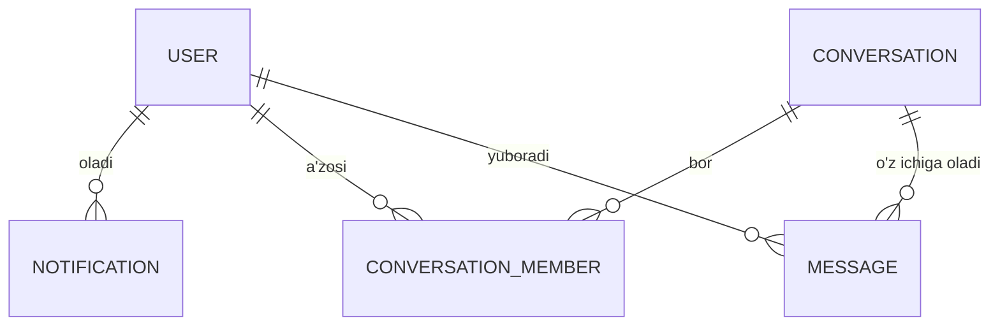

# Navbar, rollar, profil, bildirishnomalar va chat — dizayn hujjati

Holati: **taklif qilingan, tasdiqlanishi kutilmoqda** — bu hujjatdagi hech narsa hali
qurilmagan. Bu loyiha egasi kod yozishdan oldin so'ragan, ko'rib chiqiladigan
struktura. Tasdiqlangandan (yoki qayta ko'rilgandan) so'ng, amalga oshirish
"Qurish tartibi" bo'limidagi bosqichlar bo'yicha ketma-ket boradi, har bir bosqichdan
so'ng `PROGRESS.md` yangilanadi va alohida commit qilinadi
(`.claude/rules/git-and-commits.md`ga muvofiq).

## Maqsadlar

- Haqiqiy navbar: real-time o'qilmagan hisoblagichi bilan bildirishnoma qo'ng'irog'i
  (bell), profil menyusi (avatar, ism, rol belgisi, chiqish).
- Profil sahifasi: ism/username/avatarni tahrirlash, parolni almashtirish.
- Haqiqiy global rol tizimi (`admin` / `auditor` / `viewer`) — mavjud
  bino-bo'yicha `owner`/`editor`/`viewer` ulashish roli bilan aralashtirilmaydi,
  u o'zgarishsiz qoladi.
- Ro'yxatdan o'tganda Resend orqali xush kelibsiz emaili; **kirishda email
  yo'q** (loyiha egasi bilan tasdiqlangan — pastdagi "Email" bo'limiga
  qarang). Parolni tiklash mavjud link-asosidagi Better Auth oqimi orqali
  davom etadi — bu allaqachon ishlayotgan, eng optimal yechim, qayta
  qurilmaydi.
- `username` ro'yxatdan o'tganda avtomatik ravishda email manzilga teng
  qo'yiladi (birlamchi qiymat sifatida — email allaqachon unique/majburiy,
  shuning uchun to'qnashuv bo'lishi mumkin emas), keyin foydalanuvchi
  profilida uni istalgan bo'sh (band bo'lmagan) qiymatga tahrirlashi mumkin.
- Real-time bildirishnomalar: bell sahifa qayta yuklanmasdan yangilanadi.
- Real-time chat: username bo'yicha 1:1, va guruh chat — **Telegramdek qulay**:
  yozayotganlik indikatori, online/oxirgi ko'rilgan holat, o'qilganlik
  belgisi (✓✓), xabarga javob berish (reply/quote), o'z xabaringizni
  tahrirlash/o'chirish, rasm/fayl biriktirish (loyiha egasi bilan
  tasdiqlangan — pastdagi to'liq tavsifga qarang).

## Maqsad emas (hozirgi bosqich uchun)

Telegram cheksiz feature to'plamiga ega; ko'lam sezdirmasdan cheksiz
kengaymasligi uchun quyidagilar **ushbu bosqichda qo'shilmaydi**, hatto
yuqoridagi "Telegramdek qulay" talabi doirasida ham:
- Emoji reaksiyalar, xabarlar bo'yicha qidiruv, ovozli/video qo'ng'iroqlar,
  o'z-o'zini yo'q qiluvchi xabarlar, kanal/broadcast-list turi.
- Bir xabarga bir nechta biriktirma (Telegram kabi) — MVP bosqichida bitta
  xabar = bitta (ixtiyoriy) biriktirma.
- Guruh a'zolari uchun batafsil "kim qachon o'qidi" ro'yxati (Telegram
  guruhlaridagi kabi) — MVP faqat oddiy ✓✓ (hammasi o'qildimi) ko'rsatadi,
  guruh a'zolarining har birining alohida ro'yxatini emas.
- Uchta global roldan tashqari nozik darajadagi ruxsatlar (masalan maxsus
  ruxsat to'plamlari) — mavjud bino-bo'yicha rol resurs darajasidagi
  ulashishni allaqachon qamrab oladi.
- Brauzer tab'idan tashqari push bildirishnomalar (mobil push, har bir xabar
  uchun email) — bell + ro'yxatdan o'tish emaili hozircha to'liq
  bildirishnoma sirtini tashkil qiladi.

## Nima uchun bu kerak / nima sabab bo'ldi

Ilovada hozircha bino-bo'yicha ulashishdan tashqari hech qanday
ijtimoiy/hamkorlik qatlami yo'q — foydalanuvchilar bir-biriga xabar yoza
olmaydi, bildirishnoma tizimi yo'q, va navbar yalang'och (faqat nav
link'lar + oddiy chiqish tugmasi, `apps/web/src/components/app-shell.tsx`).
`user.role` ustuni mavjud, lekin haqiqatan ham o'lik — Better Auth'ning
skeffolding qoldig'i, `packages/db/src/schemas/enums.ts`da ishlatilmaydi deb
hujjatlashtirilgan. Ushbu tashabbus ilovaga haqiqiy identifikatsiya/ijtimoiy
qatlam beradi: siz kimsiz (profil, rol), nima sodir bo'ldi (bildirishnomalar),
va kimga murojaat qila olasiz (chat).

## Ma'lumotlar modeli

### Yangi enum

```ts
// packages/db/src/schemas/enums.ts
export const userRoleEnum = pgEnum("user_role", ["admin", "auditor", "viewer"]);
```

Bu **global** rol, `buildingMemberRoleEnum` (`owner`/`editor`/`viewer`,
bino-bo'yicha ulashish) bilan bog'liq emas. Ikkalasi tasodifan o'xshash
nomlangan — ularni aralashtirmang. `admin` — `/admin/users` sahifasini va rol
tayinlashni ochadi; `auditor` — oddiy ishchi rol (bugungi yashirin
standart); `viewer` — u bilan ulashilgan har qanday binolar ustiga
qo'yiladigan, faqat-o'qish uchun global daraja (masalan nazorat/mijoz
akkaunti).

### `user` jadvaliga o'zgarishlar

```ts
// packages/db/src/schemas/auth.ts
role: userRoleEnum("role").notNull().default("auditor"),   // avval: text, default "auditor"
username: text("username").notNull().unique(),              // yangi — birlamchi qiymat = email
```

**Username = email — backfill oddiy va to'qnashuvsiz.** Slug hosil qilish
yoki raqamli qo'shimcha kerak emas, chunki `email` ustuni allaqachon
`NOT NULL UNIQUE`: mavjud qatorlar uchun bitta migratsiya ichida
`UPDATE "user" SET username = email WHERE username IS NULL` bilan backfill
qilinadi, va shu zahoti `NOT NULL UNIQUE` qo'shish xavfsiz (email'ning o'zi
unique bo'lgani uchun to'qnashuv fizik jihatdan mumkin emas —
`.claude/rules/database.md`dagi oldindan-tekshiruv qoidasi shu yerda
avtomatik qanoatlantiriladi). Yangi ro'yxatdan o'tishlarda ham xuddi shunday:
Better Auth'ning `user.create.before` hook'i (Phase 6dagi email
hook'lari bilan bir joyda) yozuv kiritilishidan oldin `username`ni
`email`ga tenglashtiradi. Foydalanuvchi keyinroq profilida uni istalgan
band bo'lmagan qiymatga o'zgartirishi mumkin — o'sha paytdagi tekshiruv
`PATCH /api/users/me`da (409 to'qnashuvda).

### Yangi jadvallar

```ts
// ilova ichidagi bildirishnoma tasmasi (bell)
notification: {
  id, userId (FK -> user),
  type,                 // masalan "chat_message" | "building_shared"
  title, body, linkUrl,
  isRead (default false),
  createdAt,
}
// (userId, createdAt) bo'yicha indekslangan — bell doim "mening so'nggi
// bildirishnomalarim"ni so'raydi

// chat
conversation: {
  id, type,              // "direct" | "group"
  name,                  // to'g'ridan-to'g'ri suhbatlar uchun null
  createdBy, createdAt,
}
conversationMember: {
  conversationId (FK), userId (FK),
  role,                  // "owner" | "member" — owner guruhni qayta nomlashi/
                         // a'zo qo'shishi/olib tashlashi mumkin
  joinedAt, lastReadAt,  // lastReadAt ham o'qilmagan hisoblagichini, ham ✓✓
                         // o'qilganlik belgisini boshqaradi (boshqa a'zoning
                         // lastReadAt >= xabarning createdAt bo'lsa — o'qilgan)
}
message: {
  id, conversationId (FK), senderId (FK),
  body, createdAt, editedAt,
  replyToId,             // FK -> message, nullable — iqtibos qilib javob berish
  deletedAt,             // nullable — soft delete (qator o'chirilmaydi, tombstone
                         // ko'rsatiladi: "xabar o'chirildi")
  attachmentUrl, attachmentName, attachmentMimeType, attachmentSizeBytes,  // barchasi nullable
}
```

**Presence (online/oxirgi ko'rilgan) va yozayotganlik indikatori uchun yangi
jadval kerak emas** — ular tabiatan vaqtinchalik (ephemeral): "online"
holati shunchaki foydalanuvchining `UserNotificationChannel` DO'siga hozir
ulangan socket'i bor-yo'qligi (ilova ochiq bo'lsa doim ulangan, chunki bell
ham shu ulanishga tayanadi); "yozayotganlik" — `ConversationRoom` orqali
boshqa a'zolarga saqlanmasdan translatsiya qilinadigan vaqtinchalik hodisa.
Faqat **"oxirgi marta qachon ko'rilgan"** (foydalanuvchi oflayn bo'lganda)
saqlanishi kerak — buning uchun `user` jadvaliga `lastSeenAt` ustuni
qo'shiladi, `UserNotificationChannel` socket uzilganda yangilanadi.

### Munosabatlar diagrammasi



## Durable Objects arxitekturasi (real-time transport)

API Cloudflare Workers'da ishlaydi (`apps/api`), unda doimiy Node protsessi
yo'q — real-time push uchun **Durable Objects** kerak (Cloudflare-native,
butun stack'ni bitta vendor'da saqlaydi, boshqariladigan yangi tashqi
xizmat/sir kerak emas). Bu loyiha uchun yangi infratuzilma: bugungi
`wrangler.toml`da faqat R2 bucket va rate-limit binding bor, DO/KV/Queues yo'q.

Ikkita DO klassi:

- **`ConversationRoom`** — har bir suhbat uchun bitta instansiya
  (`idFromName(conversationId)`). Klient unga WebSocket ochadi (DO id'sini
  topib, upgrade so'rovini yo'naltiruvchi Worker route orqali). Xabar socket
  orqali kelganda, DO'ning o'zi qatorni Postgres'ga yozadi (umumiy `@yres/db`
  klienti orqali — Neon HTTP drayveri DO ichidan ham yaxshi ishlaydi, bu
  shunchaki boshqa Workers ijro konteksti) va keyin saqlangan qatorni o'sha
  suhbatga hozir ulangan har bir socket'ga tarqatadi. **Postgres yagona
  haqiqat manbai bo'lib qoladi; DO faqat tarqatish nuqtasi** — u bazadan
  qayta tiklab bo'lmaydigan hech qanday holatni saqlamaydi. Bo'sh
  ulanishlar DO'ni xotirada ushlab turmasligi uchun WebSocket Hibernation
  API'sidan (`state.acceptWebSocket`) foydalanadi.
- **`UserNotificationChannel`** — har bir foydalanuvchi uchun bitta
  instansiya (`idFromName(userId)`). Klient real-time bell yangilanishlarini
  olish uchun unga WebSocket ochadi. `notification` qatorini yaratadigan har
  qanday backend amali (bino ulashildi, suhbat xonasida bo'lmagan
  qabul qiluvchiga yangi chat xabari) umumiy
  `notifyUser(env, db, userId, notification)` yordamchisini chaqiradi — u
  qatorni kiritadi **va** agar hozir ochiq socket bo'lsa, shu DO'ga
  fire-and-forget push yuboradi.

`ConversationRoom` socket orqali almashadigan xabar turlari kengaytiriladi:
oddiy yangi-xabar broadcast'idan tashqari, `typing` (vaqtinchalik, saqlanmaydi),
`read` (kimdir shu suhbatni o'qidi — `conversationMember.lastReadAt`ni
yangilaydi va boshqalarga ✓✓ yangilanishini translatsiya qiladi),
`message_edited` va `message_deleted` (tegishli `message` qatori
yangilangandan/soft-delete qilingandan keyin translatsiya qilinadi).

**Rasm/fayl biriktirmalar uchun yangi R2 bucket** kerak (mavjud
`REPORTS_BUCKET`dan alohida — huquqlar/hajm siyosati boshqacha bo'lishi
mumkin): masalan `CHAT_ATTACHMENTS_BUCKET`. Yuklash oqimi: klient avval
`POST /api/chat/attachments`ga fayl yuboradi (R2'ga saqlanadi, URL
qaytariladi), keyin xabarni shu `attachmentUrl` bilan yuboradi — xuddi
Excel-hisobot PDF'lari `REPORTS_BUCKET`da saqlangani kabi andoza.

### Ma'lum cheklovlar, ochiq aytilgan

- **Bu sandbox hech qaysi DO'ni integratsion tekshira olmaydi.** Bu yerda
  Cloudflare runtime yo'q va lokal Postgres yo'q
  (`.claude/rules/testing-and-verification.md`ga qarang). Haqiqiy
  WebSocket/broadcast xatti-harakati haqiqiy `wrangler deploy`dan keyin
  qo'lda tekshirilishi kerak — xuddi UI o'zgarishlari o'sha qoidalar
  faylida qo'lda tekshirilgani kabi.
- **7-bosqichdagi deploy'dan oldin Cloudflare akkaunt/rejasi Durable
  Objects'ni qo'llab-quvvatlashini tasdiqlang** — bu loyiha hech qachon DO
  ishlatmagan, shuning uchun bu allaqachon ishlayotgan narsani qayta
  tasdiqlash emas, tekshirilmagan taxmin.

## API sirti (yangi route'lar, barchasi `apps/api/src/routes/` ostida)

| Route fayli | Endpoint'lar |
|---|---|
| `users.ts` | `GET /api/users/me`, `PATCH /api/users/me` (ism/username/rasm, username to'qnashuvida 409) |
| `admin-users.ts` (faqat admin, yangi `require-role` middleware orqali) | `GET /api/admin/users`, `PATCH /api/admin/users/:id/role` |
| `notifications.ts` | `GET /api/notifications` (sahifalangan + o'qilmagan soni), `PATCH /api/notifications/:id/read`, `PATCH /api/notifications/read-all`, WS upgrade `/api/notifications/ws` → `UserNotificationChannel` |
| `chat.ts` | `GET /api/chat/conversations`, `POST /api/chat/conversations` (username bo'yicha to'g'ridan-to'g'ri, yoki nom + username'lar bilan guruh), `GET /api/chat/conversations/:id/messages`, `PATCH /api/chat/conversations/:id` (qayta nomlash/a'zo qo'shish-olib tashlash, faqat owner), `PATCH /api/chat/conversations/:id/read` (o'qildi deb belgilash), `PATCH /api/chat/messages/:id` (tahrirlash, faqat o'z xabari), `DELETE /api/chat/messages/:id` (soft delete, faqat o'z xabari), `POST /api/chat/attachments` (R2'ga fayl yuklash, URL qaytaradi), `GET /api/users/:username/presence` (oflayn bo'lsa `lastSeenAt`ni qaytaradi — onlayn holat va yozayotganlik socket orqali translatsiya qilinadi, REST orqali emas), WS upgrade `/api/chat/conversations/:id/ws` → `ConversationRoom` |

Parolni almashtirish Better Auth'ning o'z `authClient.changePassword` klient
metodidan foydalanadi (`apps/api/src/auth/index.ts`da allaqachon sozlangan
`emailAndPassword` plagini qismi) — yangi backend endpoint kerak emas;
amalga oshirish boshlanganda o'rnatilgan Better Auth versiyasida bu metod
mavjudligini tasdiqlash kerak.

## Frontend

- `apps/web/src/components/app-shell.tsx`: `NAV_ITEMS` qatorlariga ixtiyoriy
  `roles?: UserRole[]` filtri qo'shiladi (uni ham desktop sidebar, ham mobil
  header o'qiydi — `.claude/rules/frontend.md`ga ko'ra, faqat ikkitadan
  bittasiga qo'shilgan nav elementi aynan o'sha qoida oldini olishga
  mo'ljallangan bug). Yangi `NotificationBell` (Popover + belgi) va
  `ProfileMenu` (DropdownMenu + Avatar) komponentlari ikkalasiga ham
  qo'shiladi.
- Yangi route'lar: `_authenticated/profile.tsx`, `_authenticated/admin/users.tsx`
  (`_authenticated.tsx`ning session tekshiruvi bilan bir xil andozada
  `beforeLoad`da admin-gated), `_authenticated/chat/index.tsx` +
  `_authenticated/chat/$conversationId.tsx`.
- Yangi `packages/ui` primitivlari (bugun hech biri yo'q): `dropdown-menu.tsx`,
  `popover.tsx`, `avatar.tsx` (yupqa Radix o'ramlari, `dialog.tsx` bilan bir
  xil andoza), va `sonner` orqali toast primitivi. **Yangi utility klasslar
  Tailwind `@source` kontent skanidan haqiqiy build'da omon qolishini
  tekshirish shart** — bu aynan `.claude/rules/frontend.md`da
  hujjatlashtirilgan buzilish turi (bir marta production'da `Button`ni
  sezdirmasdan buzgan edi).
- Yangi hook'lar: `use-notifications.ts` (react-query ro'yxat/hisoblagich +
  WebSocket obuna), `use-chat.ts` (suhbat-bo'yicha xabarlar ro'yxati +
  WebSocket).
- **Chat UI, Telegram andozasida**: jo'natuvchi bo'yicha guruhlangan
  xabar-pufakchalari (bubble), har birida vaqt belgisi; javob berilgan
  xabar pufakcha ustida iqtibos sifatida ko'rsatiladi; o'z xabaringizga
  sichqoncha o'ng tugmasi/uzoq bosish orqali tahrirlash/o'chirish menyusi;
  suhbat sarlavhasida online nuqta yoki "oxirgi marta ... da ko'rilgan";
  pastda "... yozmoqda" qatori; xabar tagida ✓ (yuborildi) / ✓✓ (o'qildi);
  rasm/fayl uchun preview + yuklab olish tugmasi.

## Email

`apps/api/src/lib/email.ts`da allaqachon ishlaydigan `sendEmail()` bor (Resend'ga
oddiy fetch, parolni tiklash/tasdiqlash uchun allaqachon ishlatilgan).

### Ro'yxatdan o'tish — xush kelibsiz emaili (yagona yangi email chaqiruvi)

`apps/api/src/auth/index.ts`ga Better Auth `databaseHooks.user.create.after`
qo'shiladi: yangi foydalanuvchi yaratilgach, `sendEmail()` orqali xush
kelibsiz xabari yuboriladi. (`user.create.before` bosqichida, xuddi shu
hook zanjirida, `username = email` ham o'rnatiladi — yuqoridagi
"Ma'lumotlar modeli" bo'limiga qarang.)

### Kirish — email yo'q

Loyiha egasi bilan tasdiqlangan: **login qilishda hech qanday email
yuborilmaydi** — na har safar, na yangi qurilma/joy uchun. (Bu avvalgi,
"faqat yangi qurilmada ogohlantirish" degan oraliq qarordan ham voz
kechish — ortiqcha murakkablik: qurilma-fingerprint kuzatuvi va
`userKnownDevice` jadvali kerak emas, shuning uchun sxemadan olib
tashlandi.) Amalda bu shuni anglatadi: `session.create.after`ga hech qanday
email-yuboruvchi hook ulanmaydi.

### Parolni tiklash — mavjud link-asosidagi oqim, o'zgarishsiz qoladi

Bu allaqachon ishlaydi: `apps/api/src/auth/index.ts`dagi
`emailAndPassword.sendResetPassword` hook'i (Better Auth'ning o'rnatilgan
mexanizmi) va frontend'dagi `forgot-password.tsx`/`reset-password.tsx`
route'lari orqali. Foydalanuvchi parolni unutganda email manziliga
muddati tugaydigan, bir martalik token bilan **link** yuboriladi (kod
emas). Bu **eng optimal yechim sifatida tanlangan va qayta qurilmaydi**:
- Link bir bosishda ishlaydi — foydalanuvchi kodni qo'lda kiritishi
  shart emas (kamroq ishqalanish, ayniqsa mobil qurilmada).
- Token muddati va bir martalik ishlatilishi Better Auth tomonidan
  allaqachon boshqariladi — qo'shimcha xavfsizlik logikasi yozish kerak
  emas.
- Bir martalik raqamli kod (masalan SMS-uslubidagi) qo'shimcha UI (kod
  kiritish maydoni, qayta yuborish taymeri) va ko'proq ishqalanish talab
  qiladi, hech qanday xavfsizlik yoki qulaylik ustunligisiz — shuning
  uchun tanlanmadi.

Bu oqim ushbu tashabbusning bir qismi sifatida **qayta qurilmaydi**, faqat
shu yerda hujjatlashtirilmoqda, chunki loyiha egasi buni "eng optimal
yechim" so'rovi doirasida tilga oldi — javob: u allaqachon mavjud va
optimal.

Profildagi **parol almashtirish** (foydalanuvchi tizimga kirgan holda,
joriy parolini bilib turib) esa alohida oqim — yuqoridagi "API sirti"
bo'limidagi Better Auth `authClient.changePassword`ga qarang, u ham
qayta qurilmaydi, faqat frontend'dan chaqiriladi.

(Aniq Better Auth `databaseHooks` nomlari/payload shakllari amalga
oshirish boshlanganda o'rnatilgan versiyaga qarab tasdiqlanadi.)

## Qurish tartibi

1. **Sxema** — enum, `username` (email'dan backfill) + `NOT NULL UNIQUE`,
   `notification`, `conversation`/`conversationMember`/`message`.
   Migratsiya, type-check, commit.
2. **`packages/ui` primitivlari** — dropdown-menu, popover, avatar, toast.
   Quriladigan CSS'ni tekshirish, commit.
3. **Navbar** — bell (stub, haqiqiy ma'lumot keyinroq) + profil menyusi,
   desktop va mobilda rol bo'yicha filtrlangan nav elementlari. Commit.
4. **Profil va parol** — profil route + `users.ts` route + Better Auth
   `changePassword`. Commit.
5. **Rollar/admin** — `require-role` middleware, `admin-users.ts`,
   `/admin/users` sahifasi, rol belgisi. Commit.
6. **Email** — `user.create.before` (username=email) + `user.create.after`
   (xush kelibsiz emaili) hook'lari. Kirish uchun hech qanday hook
   qo'shilmaydi; parolni tiklash mavjud oqim bo'yicha o'zgarishsiz qoladi.
   Commit.
7. **Durable Objects infratuzilmasi** — wrangler binding'lari/migratsiyalari,
   DO klass skeletlari. Commit (haqiqiy deploy bilan to'liq tekshirilishi
   kerakligi belgilangan holda).
8. **Bildirishnomalar** — route'lar, `notifyUser()` yordamchisi,
   `UserNotificationChannel` orqali jonli bell. Commit.
9. **Chat backend** — suhbat/xabar route'lari (yaratish, tahrirlash, soft
   delete, o'qildi-belgilash), username qidiruvi, guruh boshqaruvi,
   biriktirma-yuklash uchun yangi `CHAT_ATTACHMENTS_BUCKET` R2 binding'i.
   Commit.
10. **Chat real-time + frontend** — `ConversationRoom` ulanishi (xabar,
    typing, read, edited, deleted event'lari), chat route'lari/UI
    Telegram-uslubidagi pufakcha/reply/online-holat/✓✓ bilan, "yangi chat"
    dialogi (to'g'ridan-to'g'ri/guruh), `NAV_ITEMS`ga "Chat" qo'shish. Commit.
11. **Yakunlash** — to'liq type-check/build/lint/test o'tkazish, mock-API-server
    usuli orqali UI tekshiruvi, `PROGRESS.md` yangilash, qurish davomida
    haqiqatan duch kelingan nozik jihatlar bilan yangi
    `.claude/rules/realtime.md` — `CLAUDE.md`ning qoidalar jadvaliga qo'shilgan
    holda.

## Ochiq xatarlar / qurishdan oldin aqlga sig'diriladigan qarorlar

- **Durable Objects bu loyiha uchun mutlaqo yangi infratuzilma** — ergashadigan
  mavjud andoza yo'q, joriy Cloudflare rejasiga nisbatan tekshirilmagan, va bu
  sandbox'da butunlay testlab bo'lmaydi. 7/10-bosqichlar shunchaki toza
  type-check emas, tugallangan deb hisoblanishidan oldin haqiqiy-deploy
  tekshiruvini talab qiladi.
- **Kirish emaili talabi butunlay olib tashlandi** — dastlab "har bir
  kirishda email", keyin "faqat yangi qurilmada" bo'lgan, endi loyiha
  egasining oxirgi tasdiqlashiga ko'ra **umuman yo'q**. Bu qaror ikki marta
  o'zgargani uchun ayniqsa ochiq hujjatlashtirilmoqda — `userKnownDevice`
  jadvali va fingerprint-kuzatuv sxemadan butunlay olib tashlandi, endi
  qayta paydo bo'lmasin.
- **Chat biriktirmalari uchun yangi R2 bucket xarajat/hajm siyosatini
  talab qiladi** — `REPORTS_BUCKET`dan alohida, chunki foydalanuvchilar
  yuklaydigan kontent (fayl turi/hajmi cheklovi kerak bo'ladi, hozircha
  aniq belgilanmagan — implementatsiya vaqtida oqilona chegara qo'yiladi,
  masalan rasm uchun bir necha MB, va bu shu yerda keyinroq hujjatlashtiriladi).
- **"Telegramdek qulay" talabi ataylab chegaralangan** — loyiha egasi bilan
  aniq to'rtta imkoniyat (presence/typing, ✓✓, reply+tahrirlash/o'chirish,
  biriktirma) tasdiqlangan; yuqoridagi "Maqsad emas" ro'yxatidagi
  qolganlari (reaksiyalar, qidiruv, qo'ng'iroqlar va h.k.) alohida so'ralmasa
  qo'shilmaydi.
